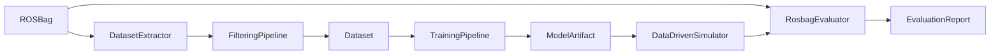

# Data-Driven 2D Simulator Package for Special Vehicles

## Purpose

This document proposes a new Autoware simulator package that reproduces the 2D motion response of special vehicles with data-driven models.

The target is not a high-fidelity physics simulator. The package should behave like `autoware_simple_planning_simulator`: it runs in the Autoware graph, consumes vehicle commands or actuation commands, publishes simulated ego state topics, and is useful for planning/control integration tests. The difference is that the vehicle response is learned from recorded ROS bags so that non-standard vehicles can be represented without deriving a full analytic model.

Primary target vehicles:

- Factory AGV/AMR platforms with differential drive, skid steer, steer-by-wire, or omnidirectional wheels.
- Construction or industrial carrier vehicles whose actuator response is difficult to express with a simple first-order delay model.
- Small autonomous platforms whose command-to-motion response changes by vehicle type, payload, or low-level controller implementation.

MVP assumptions:

- Simulate only planar 2D motion: `x`, `y`, `yaw`, longitudinal/lateral velocity, yaw rate, and optional actuator states.
- Ignore explicit disturbance modeling, road friction modeling, terrain interaction, collision, sensing, and payload dynamics.
- Treat friction, slip, actuator delay, dead zones, and low-level controller behavior as effects that may be implicitly learned from data, not as separately modeled physical terms.
- Evaluate against held-out ROS bags by replaying the same command sequence and comparing predicted 2D state trajectories.

## Why Data-Driven Modeling

Special vehicles often do not fit the simple passenger-car assumptions used by bicycle or first-order steering models. Examples include skid-steer robots, omnidirectional platforms, hydraulic or electric actuators with dead zones, and low-level controllers that expose vendor-specific actuation commands.

Relevant research supports this direction:

- Neural-network vehicle dynamics models can replace or augment physics-based single-track models by predicting the next vehicle state from recent states and control inputs. See [Neural Networks for Vehicle Dynamics Modeling](https://github.com/TUMFTM/NeuralNetwork_for_VehicleDynamicsModeling), associated with arXiv material on NN-based vehicle dynamics simulation.
- Apollo's deep residual model work describes a vehicle dynamics learning pipeline with collection, evaluation, verification, and control-in-the-loop style testing. See [Deep Residual Model for Vehicle Dynamics](http://arxiv.org/pdf/2011.00646v1).
- Skid-steer robots have strong nonlinear command-to-motion behavior, especially through skid and slip. A probabilistic data-driven motion model using Gaussian Processes showed improved motion prediction over conventional kinematics on multi-terrain skid-steer data. See [A Probabilistic Motion Model for Skid-Steer Wheeled Mobile Robot Navigation on Off-Road Terrains](https://arxiv.org/html/2402.18065v1).
- Data-driven stochastic MPC for skid-steer robots combines learned GP residuals with a nominal model and evaluates path-following/obstacle behavior under uncertainty. The simulator package can borrow the model-selection and evaluation structure even if the MVP does not model uncertainty. See [Data-Driven Sampling Based Stochastic MPC for Skid-Steer Mobile Robot Navigation](https://arxiv.org/html/2411.03289).
- Omnidirectional mobile manipulators have been modeled from input-output data with Koopman operator methods and then controlled with linear MPC. This is relevant for omni-wheel and mecanum-wheel AMRs because it avoids assuming an Ackermann steering geometry. See [Koopman operator based model predictive control for trajectory tracking of an omnidirectional mobile manipulator](https://journals.sagepub.com/doi/10.1177/00202940221095559).
- Robust Koopman approaches for omnidirectional platforms add disturbance observers or GPR residual correction to compensate model error. For this package, those ideas should be reserved for future extensions after the 2D deterministic MVP. See [Implementation of a robust data-driven control approach for an omni-directional mobile manipulator based on Koopman operator](https://journals.sagepub.com/doi/10.1177/00202940221094843).
- Physics-informed and hybrid learned models are active research areas for heavy machinery and hydraulic systems. They support the long-term direction but should not be treated as required for the MVP. See [Physics-Informed Neural Networks-Based Online Excavation Trajectory Planning for Unmanned Excavator](https://link.springer.com/article/10.1186/s10033-024-01109-2) and [A Data-Driven Modeling and Motion Control of Heavy-Load Hydraulic Manipulators via Reversible Transformation](https://arxiv.org/html/2411.13856v1).

## Package Concept

Proposed package name:

- `autoware_data_driven_planning_simulator`

The package should consist of five layers:

- ROS integration layer: subscribes to command topics, publishes odometry, steering/status reports, TF, and optional debug topics.
- Data extraction layer: converts ROS bags into synchronized, filtered datasets.
- Model layer: supports multiple learned 2D dynamics backends behind a common interface.
- Training layer: trains and exports models from datasets.
- Evaluation layer: replays held-out ROS bags through the learned simulator and compares predicted motion against recorded motion.

The package should not depend on a single vehicle geometry. Instead, each vehicle profile defines:

- State vector names.
- Command/input vector names.
- Output topic mapping.
- Coordinate frame convention.
- Model backend and model artifact path.
- Dataset filtering rules.
- Evaluation metrics and pass/fail thresholds.

## Supported Vehicle Patterns

The package should support these patterns through configuration and model adapters.

Ackermann-like vehicles:

- Inputs: target velocity/acceleration, steering angle or steering rate.
- States: `x`, `y`, `yaw`, `vx`, `wz`, `steer`.
- Baseline model: bicycle or Autoware-style delay steering model.
- Learned model: residual MLP, temporal CNN, LSTM/GRU, or Koopman model.

Differential drive or skid-steer vehicles:

- Inputs: left/right wheel velocity, body velocity command, or vendor-specific actuation command.
- States: `x`, `y`, `yaw`, `vx`, `wz`, optionally `vy`.
- Baseline model: unicycle or differential drive kinematics.
- Learned model: residual model for `vx` and `wz`, or a direct sequence model.

Omnidirectional or mecanum vehicles:

- Inputs: `vx_cmd`, `vy_cmd`, `wz_cmd` or wheel-level commands.
- States: `x`, `y`, `yaw`, `vx`, `vy`, `wz`.
- Baseline model: planar holonomic kinematics.
- Learned model: direct state-transition model or Koopman lifted linear predictor.

Articulated or industrial special vehicles:

- Inputs: command velocity, steering/joint command, low-level actuation command.
- States: base `x`, `y`, `yaw`, `vx`, `wz`; optional articulation angle if available.
- Baseline model: unicycle, bicycle, or custom configured kinematic adapter.
- Learned model: sequence model with history window to capture delay, dead zone, and low-level actuator response.

## Data Flow



## ROS Bag to Dataset Pipeline

The extractor should read ROS 2 bags and produce a versioned dataset directory.

Required inputs:

- Ground-truth pose or odometry topic, such as `/localization/kinematic_state`, `/tf`, or `/output/odometry`.
- Command topic, such as `/control/command/control_cmd`, `/vehicle/actuation_cmd`, `/cmd_vel`, wheel command topics, or vendor-specific command topics.
- Optional status topics, such as gear, control mode, actuation status, steering report, wheel velocity, or engage state.

Recommended output format:

- `metadata.yaml`: vehicle profile, topic names, sampling period, frame names, bag URI, extraction commit, filter settings.
- `train.parquet`, `validation.parquet`, `test.parquet`: synchronized samples.
- `segments.yaml`: accepted/rejected time ranges and rejection reasons.
- `normalization.yaml`: feature means, standard deviations, limits, and angle wrapping rules.

Each sample should contain:

- Timestamp.
- State at time `t`.
- Command at time `t`.
- State at time `t + dt`.
- Optional history window features: `state[t-k:t]`, `command[t-k:t]`.
- Segment ID and bag ID to avoid train/test leakage.

For 2D motion, the canonical state should be:

```text
x, y, yaw, vx, vy, wz
```

Vehicle profiles may add:

```text
steer, articulation_angle, left_wheel_vel, right_wheel_vel, actuator_state
```

## Filtering Requirements

Filtering is critical because raw ROS bags often contain initialization, localization jumps, stale commands, manual takeover, low-speed noise, and timestamp discontinuities.

The package should implement reusable filters:

- Topic availability filter: reject ranges where required topics are missing.
- Time continuity filter: reject samples with large timestamp gaps or negative time jumps.
- Frame consistency filter: reject ranges with missing TF or inconsistent frame IDs.
- Engage/control-mode filter: keep only autonomous, manual, or configured modes.
- Velocity range filter: remove near-zero motion if it is not useful, or keep it in a separate stop/creep bucket.
- Acceleration and yaw-rate limit filter: reject physically impossible spikes caused by localization jumps.
- Command freshness filter: reject samples where command age exceeds a threshold.
- Latency compensation filter: shift command streams by a configurable delay or learn the best delay by cross-correlation.
- Resampling filter: resample all topics to a fixed `dt` with interpolation rules per signal type.
- Angle unwrap filter: unwrap yaw before differentiation and rewrap only at export.
- Smoothing filter: optionally apply offline Savitzky-Golay or low-pass filtering to pose-derived velocities.
- Maneuver coverage filter: classify data into straight, left turn, right turn, acceleration, deceleration, reverse, lateral motion, and stop segments.
- Outlier filter: reject samples by z-score, Hampel filter, robust median absolute deviation, or configured absolute bounds.
- Split leakage filter: split by bag and continuous segment, not by random rows, so adjacent samples do not leak between train and test.

The extractor should keep rejection reasons so users can inspect whether the filters are too strict.

## Model Interface

All model backends should implement the same interface:

```text
initialize(initial_state, vehicle_profile)
predict_next(state, command, dt) -> next_state
reset()
load(model_artifact)
```

The model should be usable in two modes:

- Open-loop batch mode for evaluation against a ROS bag.
- Online ROS node mode for integration tests.

Initial model backends:

- `kinematic_baseline`: configured Ackermann, unicycle, differential, or holonomic 2D model.
- `mlp_residual`: baseline model plus learned residual `delta_state`.
- `mlp_direct`: direct next-state prediction.
- `sequence_model`: TCN, LSTM, or GRU for actuator delay and hysteresis-like response.
- `koopman`: lifted linear predictor for nonlinear but structured systems.

Future backends:

- Gaussian Process residual model with uncertainty.
- Mixture-of-experts model selected by vehicle profile, speed range, payload, or command regime.
- Physics-informed model for systems where known constraints should be enforced during training.

## Training Pipeline

The training command should consume dataset directories and produce a model artifact.

Example command shape:

```bash
ros2 run autoware_data_driven_planning_simulator train_model \
  --dataset path/to/dataset \
  --vehicle-profile path/to/profile.yaml \
  --model-config path/to/model.yaml \
  --output path/to/model_artifact
```

Training should include:

- Normalization and inverse-normalization.
- Feature validation against the vehicle profile.
- Train/validation/test split by segment.
- Early stopping on validation rollout error.
- Reproducible seeds.
- Export to an inference format suitable for ROS runtime, such as ONNX, TorchScript, or a lightweight C++ backend.
- Metadata that records dataset version, model config, feature schema, and evaluation results.

The first implementation should prioritize deterministic, CPU-friendly inference over model complexity.

## Evaluation Against ROS Bags

The evaluator should replay a held-out ROS bag as follows:

- Extract initial state from the recorded state topic.
- Feed recorded commands to the simulator at the original or resampled timestamps.
- Roll out predicted state without using future recorded states.
- Compare predicted trajectory against recorded trajectory.
- Produce plots, metrics, and a machine-readable report.

Core metrics:

- Position RMSE and final displacement error.
- Yaw RMSE and final yaw error.
- Velocity RMSE: `vx`, `vy`, `wz`.
- Segment-wise errors for straight, turn, acceleration, deceleration, stop, reverse, and lateral motion.
- Short-horizon rollout errors at 1 s, 3 s, 5 s, and 10 s.
- Long-horizon drift over complete bag segments.
- Command-response delay estimate before and after modeling.

The evaluator should compare at least three models:

- Existing simple baseline model.
- Vehicle-profile kinematic baseline.
- Learned model.

This prevents the learned model from being accepted just because the evaluation dataset is easy.

## Runtime ROS Node

The runtime simulator should mirror the planning simulator style:

- Subscribe to selected command topics based on `vehicle_profile.yaml`.
- Maintain internal 2D state.
- Run model inference at a fixed timer period.
- Publish odometry, velocity, TF, and optional vehicle-specific status reports.
- Provide debug topics for model input, predicted state delta, normalized features, and filter/model health.

The node should support deterministic startup:

- Initialize from origin.
- Initialize from `/initialpose`.
- Initialize from the first message of a replayed bag.
- Reset via service.

## Configuration Files

The package should define these configuration files:

- `vehicle_profile.yaml`: state schema, command schema, topic mapping, frame names, vehicle pattern, and output mapping.
- `dataset_filter.yaml`: filtering thresholds and resampling settings.
- `model.yaml`: backend type, history length, hidden sizes, loss weights, export format.
- `evaluation.yaml`: metrics, horizon lengths, accepted thresholds, report output path.
- `simulator.param.yaml`: ROS node parameters for runtime simulation.

Vehicle profiles should be first-class artifacts. Adding a new special vehicle should usually mean adding a new profile and dataset, not changing C++ simulator code.

## Development Phases

Phase 1: Dataset extraction and evaluation foundation

- Implement ROS bag reader.
- Implement topic synchronization, resampling, yaw unwrap, velocity derivation, and rejection logging.
- Export dataset files and metadata.
- Implement open-loop evaluator against held-out bags.

Phase 2: Baseline simulator

- Implement 2D kinematic baselines for Ackermann, unicycle/differential, and holonomic motion.
- Add runtime ROS node with Autoware-compatible outputs.
- Add evaluator comparison between recorded bags and baseline rollouts.

Phase 3: Learned deterministic models

- Implement `mlp_direct`, `mlp_residual`, and `sequence_model`.
- Add training CLI and model artifact export.
- Add model inference in the runtime simulator.

Phase 4: Vehicle-pattern expansion

- Add profile examples for AGV/AMR, skid steer, omni/mecanum, and articulated special vehicles.
- Add maneuver coverage reports and segment-wise evaluation.
- Add latency compensation and command freshness diagnostics.

Phase 5: Advanced research extensions

- Add Koopman backend for systems where linear MPC compatibility matters.
- Add GP residual backend if uncertainty is needed.
- Add physics-informed constraints only when the target vehicle has known constraints worth enforcing.

## Acceptance Criteria

The MVP should be considered successful when:

- A user can select topics from a ROS bag and generate a filtered dataset.
- Filtering decisions are reproducible and inspectable.
- A model can be trained from the dataset without manual feature engineering in code.
- The trained model can be evaluated against a held-out ROS bag.
- The evaluation report shows whether the learned model improves over simple 2D baselines.
- The runtime node can replay commands in 2D and publish Autoware-style simulated state topics.
- Adding a new vehicle pattern is mostly configuration and dataset work.

## Key Risks

- If the ROS bag does not contain accurate ground-truth state, the learned simulator will learn localization noise or estimator artifacts.
- If training and evaluation splits share adjacent samples, the reported accuracy will be overly optimistic.
- If command latency is not estimated, the model may waste capacity learning a time shift.
- If the dataset lacks turns, reverse motion, stops, or lateral motion, the model will fail outside the collected regime.
- If friction and disturbance are ignored explicitly, the model may average over those effects and fail when operating conditions change.

## Recommended Initial Scope

The first implementation should avoid a universal model claim. It should instead provide a robust pipeline that supports many vehicle patterns through configuration.

Recommended first milestone:

- One AGV/AMR bag.
- One Ackermann-like Autoware vehicle bag.
- One differential or skid-steer bag if available.
- Dataset extraction with filtering.
- Kinematic baseline and MLP residual model.
- Open-loop evaluation report against held-out segments.

After this milestone, the package can be extended toward Koopman, GP residuals, or physics-informed models based on actual vehicle data and evaluation failures.
