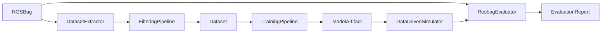

# 特殊車両向け Data-Driven 2D Simulator Package

## 目的

このドキュメントは、特殊車両の 2D 運動応答を data-driven model によって再現する、新規 Autoware simulator package の開発方針をまとめる。

目的は高忠実度な物理シミュレータを作ることではない。`autoware_simple_planning_simulator` と同様に、Autoware の graph 上で動作し、車両 command または actuation command を入力として受け取り、模擬 ego state topic を publish し、planning/control の統合テストに使える simulator を目指す。違いは、車両応答を ROS bag から学習し、通常の乗用車モデルでは表現しづらい特殊車両にも対応できるようにする点である。

主な対象車両:

- 工場内 AGV/AMR: differential drive、skid steer、steer-by-wire、omni wheel、mecanum wheel など。
- 建設・産業用搬送車両: 単純な一次遅れモデルでは actuator 応答を表現しづらい車両。
- 小型自律移動体: 車種、積載、低レベル controller の実装によって command-to-motion response が変化する platform。

MVP の前提:

- 平面 2D 運動のみを再現する。対象は `x`, `y`, `yaw`, longitudinal/lateral velocity, yaw rate, 必要に応じた actuator state とする。
- 外乱、路面摩擦、地形相互作用、衝突、sensing、payload dynamics は明示的には扱わない。
- 摩擦、slip、actuator delay、dead zone、低レベル controller の癖は、個別の物理項としてモデル化するのではなく、データから暗黙的に学習される効果として扱う。
- hold-out した ROS bag に対して同じ command sequence を replay し、予測した 2D state trajectory と記録された trajectory を比較して評価する。

## Data-Driven Modeling を採用する理由

特殊車両は、一般的な乗用車でよく使われる bicycle model や一次遅れ steering model の仮定に合わないことが多い。例として、skid-steer robot、omnidirectional platform、dead zone を持つ油圧・電動 actuator、vendor-specific な actuation command を公開する低レベル controller などがある。

この方向性を支持する関連研究:

- Neural-network vehicle dynamics model は、過去の state と control input から次時刻の vehicle state を予測することで、physics-based single-track model を置き換えたり補正したりできる。参考: [Neural Networks for Vehicle Dynamics Modeling](https://github.com/TUMFTM/NeuralNetwork_for_VehicleDynamicsModeling)。
- Apollo の deep residual model は、vehicle dynamics の学習について、data collection、evaluation、verification、control-in-the-loop testing を含む pipeline を示している。参考: [Deep Residual Model for Vehicle Dynamics](http://arxiv.org/pdf/2011.00646v1)。
- Skid-steer robot は skid/slip による強い非線形 command-to-motion behavior を持つ。Gaussian Process を用いた probabilistic data-driven motion model は、multi-terrain skid-steer data において conventional kinematics より良い motion prediction を示している。参考: [A Probabilistic Motion Model for Skid-Steer Wheeled Mobile Robot Navigation on Off-Road Terrains](https://arxiv.org/html/2402.18065v1)。
- Skid-steer robot 向け data-driven stochastic MPC は、nominal model と GP residual を組み合わせ、path-following や obstacle behavior を uncertainty 付きで評価している。本 package の MVP では uncertainty を扱わないが、model selection と評価構造は参考になる。参考: [Data-Driven Sampling Based Stochastic MPC for Skid-Steer Mobile Robot Navigation](https://arxiv.org/html/2411.03289)。
- Omnidirectional mobile manipulator では、input-output data から Koopman operator に基づく model を構築し、linear MPC で trajectory tracking を行う研究がある。Ackermann steering geometry を仮定しないため、omni-wheel や mecanum-wheel AMR に関連する。参考: [Koopman operator based model predictive control for trajectory tracking of an omnidirectional mobile manipulator](https://journals.sagepub.com/doi/10.1177/00202940221095559)。
- Omnidirectional platform 向け robust Koopman approach では、disturbance observer や GPR residual correction によって model error を補償する。MVP 後の拡張候補として扱うのが妥当である。参考: [Implementation of a robust data-driven control approach for an omni-directional mobile manipulator based on Koopman operator](https://journals.sagepub.com/doi/10.1177/00202940221094843)。
- 建設機械や油圧系では physics-informed model や hybrid learned model が研究されている。長期的な方向性として有用だが、2D deterministic simulator の MVP に必須とはしない。参考: [Physics-Informed Neural Networks-Based Online Excavation Trajectory Planning for Unmanned Excavator](https://link.springer.com/article/10.1186/s10033-024-01109-2), [A Data-Driven Modeling and Motion Control of Heavy-Load Hydraulic Manipulators via Reversible Transformation](https://arxiv.org/html/2411.13856v1)。

## 理論的定式化

この package で扱う simulator は、高忠実度な連続時間物理 simulator ではなく、ROS runtime の sampling period `dt` に合わせた離散時間 2D state transition model として定義する。

基本 state は次のように置く。

$$
x_k =
\begin{bmatrix}
p_{x,k} & p_{y,k} & \psi_k & v_{x,k} & v_{y,k} & \omega_k
\end{bmatrix}^{\mathsf{T}}
$$

ここで `p_x`, `p_y` は map または odom frame 上の 2D position、`\psi` は yaw、`v_x`, `v_y` は planar velocity、`\omega` は yaw rate とする。Vehicle profile に応じて、steering angle、wheel velocity、articulation angle、actuator state などを追加する。

$$
\tilde{x}_k =
\begin{bmatrix}
x_k^{\mathsf{T}} & s_k^{\mathsf{T}}
\end{bmatrix}^{\mathsf{T}}
$$

`s_k` は vehicle-specific state であり、例として `steer`, `left_wheel_vel`, `right_wheel_vel`, `articulation_angle`, `actuator_state` を含む。

入力は command topic から作る。

$$
u_k =
\begin{bmatrix}
u_{1,k} & u_{2,k} & \cdots & u_{m,k}
\end{bmatrix}^{\mathsf{T}}
$$

`u_k` は車両 pattern によって意味が変わる。Ackermann-like vehicle では target velocity、acceleration、steering angle。Differential/skid-steer では left/right wheel command または `v_cmd`, `w_cmd`。Holonomic vehicle では `vx_cmd`, `vy_cmd`, `wz_cmd`。Actuation command vehicle では throttle、brake、steer actuator command などを取る。

学習対象は history window を含む離散時間遷移である。

$$
\hat{x}_{k+1} = f_\theta(z_k, dt)
$$

$$
z_k =
\left[
x_k, x_{k-1}, \ldots, x_{k-H_x+1},
u_k, u_{k-1}, \ldots, u_{k-H_u+1}
\right]
$$

`H_x`, `H_u` は state と command の history length である。Actuator delay、dead zone、低レベル controller の内部状態が直接観測できない場合でも、過去の state と command を regressors として入れることで履歴依存を近似する。これは NARX/NARMAX 系の nonlinear system identification と同じ考え方である。

MVP では外乱や摩擦を明示 state として持たない。実装上の基本式は次とする。

$$
x_{k+1} = f_{\mathrm{2D}}(x_k, u_k, h_k; \theta) + \epsilon_k
$$

`h_k` は history window、`\epsilon_k` は dataset noise、localization noise、未観測の環境差を含む残差である。`friction` や `slip` を物理項として分離して推定するのではなく、観測された command-to-motion residual として学習する。ただし、運用条件が変わると residual の分布も変わりうるため、評価時には bag/segment/regime ごとの誤差を見る。

## 採用する数式モデル

この package では複数の model backend を用意するが、MVP で必須にするものと将来拡張に分ける。

### 1. Kinematic Baseline

すべての learned model は、まず simple な 2D baseline と比較する。Baseline は評価の下限であり、learned model の改善が本当に意味を持つかを判定するために必須である。

$$
\bar{x}_{k+1} = g_{\phi}(x_k, u_k, dt)
$$

`g_phi` は vehicle profile で選択される deterministic 2D kinematic model である。`\phi` は wheelbase、track width、command scale、time constant などの少数の設定値を表す。

### 2. Direct Next-State Model

もっとも単純な learned model は、history と command から次 state を直接予測する。

$$
\hat{x}_{k+1} = f_\theta(z_k, dt)
$$

または numerical stability のために state difference を予測する。

$$
\Delta \hat{x}_k = f_\theta(z_k, dt)
$$

$$
\hat{x}_{k+1} = x_k + \Delta \hat{x}_k
$$

この方式は実装が容易だが、2D 幾何制約を model が最初から学習する必要がある。そのため、MVP では direct model 単体を主力にはせず、baseline と residual model を優先する。

### 3. Residual Learning

MVP の主力は 2D baseline + residual learning とする。Apollo DRF や DyTR のような residual correction の考え方を、特殊車両向け 2D simulator に簡略化して採用する。

$$
\bar{x}_{k+1} = g_{\phi}(x_k, u_k, dt)
$$

$$
r_k = x_{k+1} - \bar{x}_{k+1}
$$

$$
\hat{r}_k = r_\theta(z_k, \bar{x}_{k+1}, dt)
$$

$$
\hat{x}_{k+1} = \bar{x}_{k+1} + \hat{r}_k
$$

この構成では、baseline が説明できる planar kinematics は baseline に任せ、特殊車両固有の command delay、actuator saturation、dead zone、controller response、skid-like behavior を residual として学習する。

MVP での採用理由:

- `autoware_simple_planning_simulator` と同じ 2D simulator の考え方を保てる。
- Ackermann、differential、holonomic など baseline を差し替えやすい。
- learned model が完全に破綻した場合でも baseline と比較できる。
- `x_{k+1}` を直接学習するより data efficiency が良い可能性が高い。

採用しない範囲:

- 残差を friction coefficient や tire force として解釈しない。
- terrain label や payload label がない限り、条件別の物理 residual としては扱わない。

### 4. Sequence / NARX Model

Actuator delay や hysteresis-like behavior を表現するため、history window を持つ NARX 型 model を採用する。

$$
y_k =
F(
y_{k-1}, \ldots, y_{k-n_y},
u_k, u_{k-1}, \ldots, u_{k-n_u}
) + e_k
$$

この package では `y_k` を state difference または next state として扱う。

$$
\Delta \hat{x}_k =
F_\theta(
x_k, \ldots, x_{k-H_x+1},
u_k, \ldots, u_{k-H_u+1}
)
$$

実装 backend としては MLP with stacked history、TCN、GRU、LSTM を候補にする。最初は MLP with stacked history または TCN を優先する。理由は inference が軽く、ROS runtime で deterministic に扱いやすいためである。

### 5. Koopman / EDMDc

Koopman model は、非線形 system を lifted space の線形 system として近似する方法である。Omnidirectional mobile manipulator や mecanum/omni AMR のように、多入力多出力で Ackermann geometry を仮定したくない場合の選択肢とする。

$$
\xi_k = \psi(x_k)
$$

制御付き EDMD では、dataset から次を最小二乗で同定する。

$$
\xi_{k+1} \approx A \xi_k + B u_k
$$

$$
\min_{A,B}
\sum_k
\left\|
\psi(x_{k+1}) - A \psi(x_k) - B u_k
\right\|_2^2
$$

元の state への projection も同定する。

$$
\hat{x}_k = C \xi_k
$$

$$
\min_C \sum_k \left\| x_k - C \psi(x_k) \right\|_2^2
$$

MVP では必須にしない。理由は dictionary/lifting の設計に依存し、residual MLP より実装・評価の自由度が高すぎるためである。一方で、線形 MPC と接続したい場合や、omni/mecanum vehicle の入出力関係を線形 predictor として扱いたい場合には有力である。

### 6. Gaussian Process Residual

Skid-steer robot の研究では、nominal model の velocity residual を GP で学習し、平均と分散を motion prediction や risk-aware planning に使う。

$$
\bar{v}_{k+1}, \bar{\omega}_{k+1} = g_{\phi}(x_k, u_k)
$$

$$
\delta v_k = v_{k+1} - \bar{v}_{k+1}
$$

$$
\delta \omega_k = \omega_{k+1} - \bar{\omega}_{k+1}
$$

$$
\delta v_k \sim \mathcal{GP}(m_v(q_k), K_v(q_k, q'_k))
$$

$$
\delta \omega_k \sim \mathcal{GP}(m_\omega(q_k), K_\omega(q_k, q'_k))
$$

ここで `q_k` は state、command、history から作る特徴量である。MVP では GP の uncertainty は実装必須にしない。まず deterministic residual model で評価 pipeline を固め、その後に uncertainty が必要な skid-steer/off-road/regime-dependent vehicle へ拡張する。

### 7. Physics-Informed / Hybrid Model

PINN や physics-guided hybrid model は、建設機械や油圧 manipulator では有効な研究方向である。ただし本 package の MVP は 2D base motion simulator であり、油圧 cylinder pressure、bucket-soil interaction、terrain force などを観測・制約化しない。したがって、PINN は初期実装の必須要件から外す。

採用する可能性がある条件:

- 既知の hard constraint がある。
- Dataset に constraint を検証できる state が含まれている。
- 通常の residual/sequence model では constraint violation が問題になる。

## 車両パターン別 Baseline 方程式

Vehicle profile は、少なくとも次の baseline のいずれかを選択する。Learned model はこれらの baseline に residual を加える形を第一候補とする。

### Baseline Integration Policy

Baseline model は residual learning の基準になるため、数値積分誤差を learned residual に押し付けてはいけない。式の説明では Euler 形式を使う場合があるが、runtime と dataset evaluation で使う baseline implementation は次の優先順位で実装する。

1. Constant-twist または constant-curvature を仮定できる場合は exact discrete integration を使う。
2. Exact integration が煩雑な vehicle profile では RK4 を使う。
3. Forward Euler は debug baseline または unit test 用に限定し、learned residual の標準 baseline にはしない。

Planar constant-twist model の exact integration は次である。

$$
p_{x,k+1} =
p_{x,k}
+
\frac{v_k}{\omega_k}
\left[
\sin(\psi_k + \omega_k dt) - \sin(\psi_k)
\right]
$$

$$
p_{y,k+1} =
p_{y,k}
-
\frac{v_k}{\omega_k}
\left[
\cos(\psi_k + \omega_k dt) - \cos(\psi_k)
\right]
$$

$$
\psi_{k+1} = \psi_k + \omega_k dt
$$

`|\omega_k|` が十分小さい場合は straight-line limit を使う。

$$
p_{x,k+1} = p_{x,k} + v_k \cos(\psi_k)dt
$$

$$
p_{y,k+1} = p_{y,k} + v_k \sin(\psi_k)dt
$$

この方針により、residual model は「baseline の離散化誤差」ではなく「vehicle-specific response」を学習しやすくなる。

### Ackermann-Like

Ackermann-like vehicle では、簡易 bicycle kinematics を baseline とする。

$$
p_{x,k+1} = p_{x,k} + v_k \cos(\psi_k) dt
$$

$$
p_{y,k+1} = p_{y,k} + v_k \sin(\psi_k) dt
$$

$$
\psi_{k+1} = \psi_k + \frac{v_k}{L}\tan(\delta_k)dt
$$

$$
v_{k+1} = v_k + a_k dt
$$

`L` は wheelbase、`\delta_k` は steering tire angle、`a_k` は acceleration command または inferred acceleration である。上記は式の意味を示す Euler 表記であり、実装では `\omega_k = v_k \tan(\delta_k) / L` として exact constant-curvature integration または RK4 を使う。Steering actuator delay を持つ場合は一次遅れを入れる。

$$
\delta_{k+1} =
\delta_k +
\frac{dt}{\tau_\delta}
(\delta^{\mathrm{cmd}}_k - \delta_k)
$$

Residual model:

$$
\hat{x}_{k+1} = g_{\mathrm{ackermann}}(x_k,u_k,dt) + r_\theta(z_k)
$$

### Differential Drive / Skid-Steer

Differential drive では wheel command から body velocity を作る。

$$
v_k = \frac{r}{2}(\omega_{R,k} + \omega_{L,k})
$$

$$
\omega_k = \frac{r}{b}(\omega_{R,k} - \omega_{L,k})
$$

`r` は wheel radius、`b` は track width である。`cmd_vel` が直接与えられる場合は `v_cmd`, `w_cmd` を使う。

$$
p_{x,k+1} = p_{x,k} + v_k \cos(\psi_k)dt
$$

$$
p_{y,k+1} = p_{y,k} + v_k \sin(\psi_k)dt
$$

$$
\psi_{k+1} = \psi_k + \omega_k dt
$$

上記は説明用の Euler 表記であり、実装では constant-twist exact integration を標準にする。Skid-steer では slip/skid を明示物理項として入れない。ただし measured velocity と nominal velocity の差を residual として学習する。

$$
\hat{v}_{k+1} = \bar{v}_{k+1} + r_{\theta,v}(z_k)
$$

$$
\hat{\omega}_{k+1} = \bar{\omega}_{k+1} + r_{\theta,\omega}(z_k)
$$

### Holonomic / Omni / Mecanum

Holonomic vehicle では body frame command `v_x`, `v_y`, `\omega` を world frame に回転して積分する。

$$
\begin{bmatrix}
\dot{p}_x \\
\dot{p}_y
\end{bmatrix}
=
\begin{bmatrix}
\cos\psi & -\sin\psi \\
\sin\psi & \cos\psi
\end{bmatrix}
\begin{bmatrix}
v_x \\
v_y
\end{bmatrix}
$$

$$
\psi_{k+1} = \psi_k + \omega_k dt
$$

Wheel-level command がある場合は、vehicle profile に wheel-to-body mapping を持たせる。

$$
\begin{bmatrix}
v_x & v_y & \omega
\end{bmatrix}^{\mathsf{T}}
=
M_{\mathrm{wheel}}
\begin{bmatrix}
\omega_1 & \omega_2 & \omega_3 & \omega_4
\end{bmatrix}^{\mathsf{T}}
$$

Learned model は、wheel slip、controller delay、lateral command の追従遅れを residual として補正する。

Holonomic vehicle で `\omega` が非ゼロの場合、実装では body-frame twist を SE(2) 上で積分するか RK4 を使う。単純に現在 yaw だけで world velocity を固定すると、旋回しながら横移動する motion で離散化誤差が residual に混入するためである。

### Articulated / Industrial Vehicle

Articulated vehicle では articulation angle `\alpha_k` を取得できる場合のみ state に入れる。

$$
x_k =
\begin{bmatrix}
p_x & p_y & \psi & v & \omega & \alpha
\end{bmatrix}^{\mathsf{T}}
$$

簡易 baseline は、base yaw rate を command または observed articulation relation から近似する。

$$
\psi_{k+1} = \psi_k + \omega_{\mathrm{base},k}dt
$$

$$
\alpha_{k+1} =
\alpha_k +
\frac{dt}{\tau_\alpha}
(\alpha^{\mathrm{cmd}}_k - \alpha_k)
$$

ただし、作業機や油圧 system の詳細 dynamic は MVP では扱わない。Base motion の 2D command-to-motion response に限定する。

## 学習・同定問題

Dataset は time-aligned samples の集合として定義する。

$$
\mathcal{D} =
\left\{
(z_k, x_{k+1}, \mathrm{segment}_k, \mathrm{bag}_k)
\right\}_{k=1}^{N}
$$

### One-Step Loss

基本 loss は one-step prediction error である。

$$
\mathcal{L}_{1}
=
\frac{1}{N}
\sum_{k=1}^{N}
\left\|
W_x
(\hat{x}_{k+1} - x_{k+1})
\right\|_2^2
$$

`W_x` は position、yaw、velocity などの scale をそろえる重みである。Yaw error は wrap を考慮する。

$$
e_\psi =
\mathrm{atan2}(\sin(\hat{\psi}-\psi), \cos(\hat{\psi}-\psi))
$$

### Multi-Step Rollout Loss

Simulator として重要なのは one-step accuracy だけではなく、open-loop rollout で drift しないことである。そのため validation では multi-step rollout loss を必須にする。

$$
\hat{x}_{k+i+1} =
f_\theta(\hat{z}_{k+i}, dt)
$$

$$
\mathcal{L}_{H}
=
\frac{1}{N_H}
\sum_k
\sum_{i=1}^{H}
\gamma_i
\left\|
W_x
(\hat{x}_{k+i} - x_{k+i})
\right\|_2^2
$$

`\gamma_i` は horizon weight である。短期応答を重視する場合は短い horizon を大きく、simulator drift を重視する場合は長い horizon も重くする。

### Residual Regularization

Residual model では、baseline より悪化する過学習を避けるため residual の大きさに regularization を入れる。

$$
\mathcal{L}_{\mathrm{res}}
=
\mathcal{L}_{1}
+
\lambda_r
\frac{1}{N}
\sum_k
\left\|
\hat{r}_k
\right\|_2^2
$$

これは residual が必要な場合だけ baseline から離れるようにするためである。

### Segment Weighted Loss

Dataset が直進や低速停止に偏ると、turn、reverse、lateral motion が学習されにくい。Maneuver class `c_k` に応じた重みを入れる。

$$
\mathcal{L}_{\mathrm{seg}}
=
\frac{1}{N}
\sum_k
w(c_k)
\left\|
W_x
(\hat{x}_{k+1} - x_{k+1})
\right\|_2^2
$$

`w(c_k)` は segment coverage report に基づいて決める。希少 maneuver を過度に無視しないことが目的である。

## ROS Bag Dataset 化の数式・判断基準

### Resampling

すべての topic は fixed sampling time `t_k = t_0 + k dt` に resample する。連続値は線形補間、離散 mode は last-value hold を使う。

$$
y(t_k) =
(1-\lambda)y(t_i) + \lambda y(t_{i+1})
$$

$$
\lambda =
\frac{t_k - t_i}{t_{i+1} - t_i}
$$

Gear、engage、control mode などの離散値は次を使う。

$$
y(t_k) = y(t_i), \quad t_i \le t_k < t_{i+1}
$$

### Yaw Unwrap

Yaw は `[-pi, pi]` のまま差分を取ると jump が発生するため、dataset 内部では unwrap する。

$$
\psi^{\mathrm{unwrap}}_k =
\psi^{\mathrm{unwrap}}_{k-1}
+
\mathrm{atan2}
(
\sin(\psi_k-\psi_{k-1}),
\cos(\psi_k-\psi_{k-1})
)
$$

### Velocity and Acceleration Derivation

Velocity label は、可能な限り ROS bag に記録された estimator output をそのまま使う。例えば `/localization/kinematic_state` の twist、vehicle status の wheel velocity、または simulator が publish した odometry twist が信頼できる場合は、それを ground-truth velocity として優先する。

Pose しかない bag では、offline fallback として finite difference で velocity を作る。ただし中心差分は未来 pose を使う非因果的な処理であり、runtime node の因果的な速度推定とは noise/latency 特性が一致しない。そのため、中心差分で作った velocity は `derived_noncausal` のように metadata に記録し、評価時に estimator-provided velocity と混同しない。

$$
v^{\mathrm{world}}_{x,k}
=
\frac{p_{x,k+1}-p_{x,k-1}}{2dt}
$$

$$
v^{\mathrm{world}}_{y,k}
=
\frac{p_{y,k+1}-p_{y,k-1}}{2dt}
$$

Body frame velocity は yaw で回転する。

$$
\begin{bmatrix}
v_{x,k} \\
v_{y,k}
\end{bmatrix}
=
\begin{bmatrix}
\cos\psi_k & \sin\psi_k \\
-\sin\psi_k & \cos\psi_k
\end{bmatrix}
\begin{bmatrix}
v^{\mathrm{world}}_{x,k} \\
v^{\mathrm{world}}_{y,k}
\end{bmatrix}
$$

Yaw rate:

$$
\omega_k =
\frac{\psi^{\mathrm{unwrap}}_{k+1} - \psi^{\mathrm{unwrap}}_{k-1}}{2dt}
$$

Runtime の挙動に近づけたい場合は、後退差分または causal low-pass differentiator を選択できるようにする。

$$
v^{\mathrm{world,causal}}_{x,k}
=
\frac{p_{x,k}-p_{x,k-1}}{dt}
$$

ただし causal difference は noise が増えやすいため、filter setting として smoothing window、group delay、使用した source topic を必ず dataset metadata に保存する。

### Command Latency Estimation

Command latency は、command と response の cross-correlation で初期推定する。

$$
\tau^\* =
\arg\max_{\tau \in [\tau_{\min}, \tau_{\max}]}
\mathrm{corr}(u(t-\tau), y(t))
$$

例として acceleration command と measured acceleration、steering command と yaw rate、`cmd_vel.wz` と measured yaw rate を対応させる。推定した latency は dataset metadata に保存し、training と evaluation で同じ shift を使う。

### Outlier Rejection

物理的に不自然な sample は、絶対閾値と robust statistics の両方で棄却する。

$$
|v_x| > v_{\max}
\quad \mathrm{or} \quad
|\omega| > \omega_{\max}
\quad \mathrm{or} \quad
|a_x| > a_{\max}
$$

Robust z-score:

$$
z_i =
\frac{|y_i - \mathrm{median}(y)|}
{1.4826 \cdot \mathrm{MAD}(y)}
$$

$$
\mathrm{reject}
\quad \mathrm{if} \quad
z_i > z_{\max}
$$

### Train/Test Split

Random row split は禁止する。連続 sample が train と test にまたがると、history window により leakage が起きるためである。

$$
\mathrm{split\_unit} = (\mathrm{bag\_id}, \mathrm{segment\_id})
$$

Train、validation、test は split unit 単位で分ける。

## 評価理論

Evaluation は one-step prediction と open-loop rollout を分離して行う。

### One-Step Prediction

Recorded state を毎 step 入力する評価であり、local model accuracy を見る。

$$
\hat{x}_{k+1} = f_\theta(z_k, dt)
$$

$$
\mathrm{RMSE}_{1}
=
\sqrt{
\frac{1}{N}
\sum_k
\left\|
W_x(\hat{x}_{k+1} - x_{k+1})
\right\|_2^2
}
$$

### Open-Loop Rollout

Initial state のみ recorded state を使い、その後は予測 state を次 step に戻す。

$$
\hat{x}_{k+i+1}
=
f_\theta(\hat{z}_{k+i}, dt)
$$

これは simulator としての本質的な評価であり、acceptance criteria では one-step より重視する。ただし、純粋な open-loop rollout は微小誤差が累積するため、complete bag 全体の drift を hard pass/fail に使わない。Hard acceptance は原則として 1 s、3 s、5 s、10 s などの固定 horizon で評価し、complete bag rollout は drift の傾向を見る diagnostic metric として扱う。

Position RMSE:

$$
\mathrm{RMSE}_{p}
=
\sqrt{
\frac{1}{N}
\sum_k
\left[
(\hat{p}_{x,k}-p_{x,k})^2
+
(\hat{p}_{y,k}-p_{y,k})^2
\right]
}
$$

Yaw RMSE:

$$
\mathrm{RMSE}_{\psi}
=
\sqrt{
\frac{1}{N}
\sum_k
\mathrm{wrap}(\hat{\psi}_k-\psi_k)^2
}
$$

Final displacement error:

$$
\mathrm{FDE}
=
\sqrt{
(\hat{p}_{x,T}-p_{x,T})^2
+
(\hat{p}_{y,T}-p_{y,T})^2
}
$$

Baseline improvement ratio:

$$
\mathrm{Improvement}
=
1 -
\frac{\mathrm{RMSE}_{\mathrm{learned}}}
{\mathrm{RMSE}_{\mathrm{baseline}}}
$$

`Improvement <= 0` の場合、learned model は baseline より悪く、採用しない。

### Controller-In-The-Loop Evaluation

Planning/control integration test での実用性を確認するには、recorded command replay だけでなく、簡易 controller を閉ループに入れた評価も追加する。例として、reference trajectory を Pure Pursuit、MPC、または package 内の simple tracking controller に与え、learned simulator 上で追従させる。

評価指標:

- Cross-track error。
- Heading error。
- Velocity tracking error。
- Goal reaching error。
- Control saturation rate。

この評価は model 単体の同定精度ではなく、Autoware integration test としての有用性を見るためのものである。MVP では optional とし、open-loop short-horizon evaluation を先に実装する。

### Segment-Wise Evaluation

全体 RMSE だけでは、低速直進が多い dataset で model が良く見える。必ず maneuver class ごとに評価する。

- Stop / creep。
- Straight。
- Acceleration。
- Deceleration。
- Left turn。
- Right turn。
- Reverse。
- Lateral motion。
- High curvature。

Acceptance は全体平均ではなく、重要 segment ごとの threshold を満たすかで判断する。

## 論文ソースと採用範囲

以下の文献は、package design の根拠として使う。ただし、論文の手法をそのまま全て実装するのではなく、MVP に必要な部分だけ採用する。

### Hermansdorfer et al., End-to-End Neural Network for Vehicle Dynamics Modeling

Source:

- [TUMFTM/NeuralNetwork_for_VehicleDynamicsModeling](https://github.com/TUMFTM/NeuralNetwork_for_VehicleDynamicsModeling)
- L. Hermansdorfer, R. Trauth, J. Betz, M. Lienkamp, `End-to-End Neural Network for Vehicle Dynamics Modeling`, IEEE CiSt 2020.

採用する点:

- 過去 state と control input から next state を予測する supervised learning 構造。
- Recorded vehicle data を training/test に分け、同じ input sequence で predicted state と actual state を比較する評価方針。

採用しない点:

- 一般乗用車の single-track 置換を package の唯一目的にはしない。
- 特定 network architecture に固定しない。

### Deep Residual Model for Vehicle Dynamics

Source:

- [Deep Residual Model for Vehicle Dynamics](http://arxiv.org/pdf/2011.00646v1)

採用する点:

- Open-loop dynamic model と residual correction model を分ける考え方。
- Data collection、evaluation、verification を pipeline として扱う設計。
- Control-in-the-loop に近い evaluation を意識し、one-step だけでなく rollout を評価する点。

採用しない点:

- SVGP や deep encoder の構成を MVP 必須にしない。
- 乗用車向けの dynamic model 詳細には依存しない。

### Residual Learning towards High-fidelity Vehicle Dynamics Modeling with Transformer

Source:

- [Residual Learning towards High-fidelity Vehicle Dynamics Modeling with Transformer](https://arxiv.org/abs/2502.11800)

採用する点:

- Physics-based base model の prediction residual を学習する考え方。
- Historical states and control signals を residual prediction に使う点。

採用しない点:

- Transformer を MVP 必須にしない。
- CarSim や 3DoF/14DoF vehicle dynamics 前提にはしない。

### Skid-Steer GP Motion Model

Source:

- [A Probabilistic Motion Model for Skid-Steer Wheeled Mobile Robot Navigation on Off-Road Terrains](https://arxiv.org/html/2402.18065v1)
- [Data-Driven Sampling Based Stochastic MPC for Skid-Steer Mobile Robot Navigation](https://arxiv.org/html/2411.03289)

採用する点:

- Skid-steer では nominal kinematics と measured velocity の差を residual として学習する考え方。
- Linear velocity residual と angular velocity residual を分ける設計。
- Terrain/regime の違いで residual が変わるという注意点。

採用しない点:

- MVP では GP variance、chance constraint、stochastic MPPI は実装しない。
- Off-road terrain modeling は対象外とする。

### Koopman / EDMDc

Source:

- [Linear predictors for nonlinear dynamical systems: Koopman operator meets model predictive control](https://arxiv.org/pdf/1611.03537)
- [Koopman operator based model predictive control for trajectory tracking of an omnidirectional mobile manipulator](https://journals.sagepub.com/doi/10.1177/00202940221095559)
- [Implementation of a robust data-driven control approach for an omni-directional mobile manipulator based on Koopman operator](https://journals.sagepub.com/doi/10.1177/00202940221094843)

採用する点:

- Input-output data から lifted linear predictor を同定する考え方。
- Omni/mecanum vehicle など Ackermann geometry を仮定しづらい system への適用可能性。
- EDMDc を least-squares problem として実装できる点。

採用しない点:

- MVP では disturbance observer や robust MPC は扱わない。
- Lifting dictionary の自動探索は初期範囲外とする。

### NARX / NARMAX Nonlinear System Identification

Source:

- S. A. Billings, `Nonlinear System Identification: NARMAX Methods in the Time, Frequency, and Spatio-Temporal Domains`, Wiley, 2013.
- O. Nelles, `Nonlinear System Identification`, Springer, 2000.

採用する点:

- 過去 output と過去/current input を regressors として使う構造。
- Actuator delay、dead zone、未観測内部状態を history window で近似する考え方。

採用しない点:

- NARMAX の noise model や全ての同定理論を package の初期要件にはしない。
- MATLAB idnlarx のような特定 tool には依存しない。

## 厳格な採用基準

MVP で model backend を採用するには、次を満たす必要がある。

- 明示的な input/output schema を vehicle profile に書ける。
- `predict_next(state, command, dt)` として runtime 実装できる。
- One-step と open-loop rollout の両方で baseline と比較できる。
- Train/test split が bag/segment 単位で分離されている。
- 重要 maneuver segment で baseline より悪化していない。
- 学習 model が失敗した場合に、baseline へ fallback できる。

次のものは MVP では採用しない。

- Terrain force、soil interaction、contact dynamics の明示モデル。
- Friction coefficient のオンライン推定。
- Payload dynamics の明示推定。
- PINN による hard physics constraint。ただし将来拡張として残す。
- Uncertainty-aware MPC、chance constraint、disturbance observer。

## Package Concept

提案 package name:

- `autoware_data_driven_planning_simulator`

package は次の 5 層で構成する。

- ROS integration layer: command topic を subscribe し、odometry、steering/status report、TF、debug topic を publish する。
- Data extraction layer: ROS bag を同期済み・filter 済み dataset に変換する。
- Model layer: 共通 interface の背後で複数の learned 2D dynamics backend を扱う。
- Training layer: dataset から model を学習し、artifact として export する。
- Evaluation layer: hold-out ROS bag を learned simulator で replay し、予測 motion と記録 motion を比較する。

単一の vehicle geometry には依存しない。代わりに vehicle profile が以下を定義する。

- State vector names。
- Command/input vector names。
- Output topic mapping。
- Coordinate frame convention。
- Model backend と model artifact path。
- Dataset filtering rules。
- Evaluation metrics と pass/fail thresholds。

## 対応すべき車両パターン

設定ファイルと model adapter によって、以下の pattern に対応できるようにする。

Ackermann-like vehicles:

- Inputs: target velocity/acceleration、steering angle または steering rate。
- States: `x`, `y`, `yaw`, `vx`, `wz`, `steer`。
- Baseline model: bicycle model または Autoware-style delay steering model。
- Learned model: residual MLP、temporal CNN、LSTM/GRU、Koopman model。

Differential drive or skid-steer vehicles:

- Inputs: left/right wheel velocity、body velocity command、vendor-specific actuation command。
- States: `x`, `y`, `yaw`, `vx`, `wz`, 必要に応じて `vy`。
- Baseline model: unicycle model または differential drive kinematics。
- Learned model: `vx` と `wz` の residual model、または direct sequence model。

Omnidirectional or mecanum vehicles:

- Inputs: `vx_cmd`, `vy_cmd`, `wz_cmd` または wheel-level commands。
- States: `x`, `y`, `yaw`, `vx`, `vy`, `wz`。
- Baseline model: planar holonomic kinematics。
- Learned model: direct state-transition model または Koopman lifted linear predictor。

Articulated or industrial special vehicles:

- Inputs: command velocity、steering/joint command、low-level actuation command。
- States: base `x`, `y`, `yaw`, `vx`, `wz`。取得可能であれば articulation angle を追加する。
- Baseline model: unicycle、bicycle、または custom configured kinematic adapter。
- Learned model: history window を持つ sequence model。delay、dead zone、低レベル actuator response を表現する。

## Data Flow



## ROS Bag から Dataset を作成する Pipeline

Extractor は ROS 2 bag を読み込み、versioned dataset directory を生成する。

必須 input:

- Ground-truth pose または odometry topic: 例 `/localization/kinematic_state`, `/tf`, `/output/odometry`。
- Command topic: 例 `/control/command/control_cmd`, `/vehicle/actuation_cmd`, `/cmd_vel`, wheel command topics, vendor-specific command topics。
- Optional status topics: gear、control mode、actuation status、steering report、wheel velocity、engage state など。

推奨 output format:

- `metadata.yaml`: vehicle profile、topic names、sampling period、frame names、bag URI、extraction commit、filter settings。
- `train.parquet`, `validation.parquet`, `test.parquet`: 同期済み samples。
- `segments.yaml`: 採用・棄却された time range と rejection reasons。
- `normalization.yaml`: feature means、standard deviations、limits、angle wrapping rules。

各 sample に含める情報:

- Timestamp。
- Time `t` の state。
- Time `t` の command。
- Time `t + dt` の state。
- Optional history window features: `state[t-k:t]`, `command[t-k:t]`。
- Train/test leakage を避けるための segment ID と bag ID。

2D motion の canonical state:

```text
x, y, yaw, vx, vy, wz
```

Vehicle profile によって追加しうる state:

```text
steer, articulation_angle, left_wheel_vel, right_wheel_vel, actuator_state
```

## Filtering Requirements

ROS bag には initialization、localization jump、古い command、manual takeover、低速域 noise、timestamp discontinuity が含まれることが多いため、filtering は重要である。

Reusable filter として実装すべきもの:

- Topic availability filter: 必須 topic が欠落している range を棄却する。
- Time continuity filter: 大きな timestamp gap や negative time jump を含む sample を棄却する。
- Frame consistency filter: TF 欠落や frame ID 不整合を含む range を棄却する。
- Engage/control-mode filter: autonomous、manual、または設定された mode のみを採用する。
- Velocity range filter: 不要な near-zero motion を除外する、または stop/creep bucket として分離する。
- Acceleration and yaw-rate limit filter: localization jump 由来の物理的に不自然な spike を棄却する。
- Command freshness filter: command age が threshold を超える sample を棄却する。
- Latency compensation filter: command stream を設定 delay だけ shift する、または cross-correlation で最適 delay を推定する。
- Resampling filter: 全 topic を固定 `dt` に resample する。補間規則は signal type ごとに定義する。
- Angle unwrap filter: yaw は微分前に unwrap し、export 時のみ rewrap する。
- Smoothing filter: pose 由来 velocity に offline Savitzky-Golay filter や low-pass filter を任意適用する。
- Maneuver coverage filter: straight、left turn、right turn、acceleration、deceleration、reverse、lateral motion、stop segment に分類する。
- Maneuver coverage validation: 必須 maneuver の sample count と duration が閾値未満なら training を fail-fast する。
- Outlier filter: z-score、Hampel filter、robust median absolute deviation、または configured absolute bounds で棄却する。
- Split leakage filter: random row split ではなく bag と continuous segment 単位で train/validation/test を分割する。

Extractor は rejection reason を保存し、filter が厳しすぎるかどうかを後から確認できるようにする。

Dataset extraction は `data_validation_report.yaml` を出力する。最低限、次を含める。

- Maneuver class ごとの sample count、duration、bag count、segment count。
- 必須 maneuver の pass/fail。例: stop、straight、left turn、right turn、acceleration、deceleration。
- Vehicle profile が要求する motion class。例: holonomic vehicle では lateral motion、reverse 対応車両では reverse。
- Training を禁止する hard failure と、警告に留める soft warning の区別。

Segment weighted loss は「少数だが存在する maneuver」の偏りを補正するためのものであり、完全に欠損した maneuver を補うものではない。必須 maneuver がゼロ件または閾値未満の場合は、training を実行せず追加データ収集を要求する。

## Model Interface

全 model backend は同じ interface を実装する。

```text
initialize(initial_state, vehicle_profile)
predict_next(state, command, dt) -> next_state
reset()
load(model_artifact)
```

Model は 2 つの mode で使えるようにする。

- ROS bag に対する open-loop batch evaluation mode。
- Integration test 用の online ROS node mode。

初期 backend:

- `kinematic_baseline`: 設定可能な Ackermann、unicycle、differential、holonomic 2D model。
- `mlp_residual`: baseline model に learned residual `delta_state` を加える model。
- `mlp_direct`: next-state を直接予測する model。
- `sequence_model`: TCN、LSTM、GRU など。actuator delay や hysteresis-like response に対応する。
- `koopman`: nonlinear だが構造がある system 向けの lifted linear predictor。

将来 backend:

- Uncertainty を持つ Gaussian Process residual model。
- Vehicle profile、speed range、payload、command regime によって切り替える mixture-of-experts model。
- 既知の制約を training に反映する physics-informed model。

## Training Pipeline

Training command は dataset directory を入力とし、model artifact を出力する。

Command 例:

```bash
ros2 run autoware_data_driven_planning_simulator train_model \
  --dataset path/to/dataset \
  --vehicle-profile path/to/profile.yaml \
  --model-config path/to/model.yaml \
  --output path/to/model_artifact
```

Training に含めるべき処理:

- Normalization と inverse-normalization。
- Vehicle profile に対する feature validation。
- Segment 単位の train/validation/test split。
- Validation rollout error に基づく early stopping。
- Reproducible seed。
- ROS runtime に適した inference format への export。例: ONNX、TorchScript、軽量 C++ backend。
- Dataset version、model config、feature schema、evaluation results を記録する metadata。

最初の実装では、model complexity より deterministic かつ CPU-friendly な inference を優先する。

Runtime inference backend は regression test の再現性に影響するため、次の制約を model artifact metadata と runtime parameter に含める。

- ONNX Runtime や TorchScript を使う場合は、thread count を固定できる設定を持つ。Regression test では single-threaded execution を標準にする。
- CPU/GPU、provider、precision、batch size、intra-op/inter-op thread 設定を model artifact metadata に保存する。
- 浮動小数点演算の platform 差を完全にゼロにすることは要求しない。評価 threshold は小さな数値差を許容する。
- Runtime node は inference latency、timeout、fallback to baseline の発生回数を debug topic または diagnostics に出す。
- Hard real-time 性を仮定しない。Timer period 内に推論が終わらない場合の挙動を `drop`, `hold_last`, `fallback_baseline` から設定できるようにする。

## ROS Bag に対する Evaluation

Evaluator は hold-out ROS bag を以下の手順で replay する。

- 記録された state topic から initial state を取得する。
- 記録された command を original timestamp または resampled timestamp で simulator に入力する。
- 未来の recorded state を使わず、予測 state を rollout する。
- 予測 trajectory と recorded trajectory を比較する。
- Plot、metrics、machine-readable report を生成する。

Core metrics:

- Position RMSE と final displacement error。
- Yaw RMSE と final yaw error。
- Velocity RMSE: `vx`, `vy`, `wz`。
- Straight、turn、acceleration、deceleration、stop、reverse、lateral motion ごとの segment-wise error。
- 1 s、3 s、5 s、10 s の short-horizon rollout error。
- Complete bag segment に対する long-horizon drift。ただしこれは diagnostic metric であり、MVP の hard acceptance には使わない。
- Optional controller-in-the-loop metrics: cross-track error、heading error、goal reaching error。
- Modeling 前後の command-response delay estimate。

Evaluator は少なくとも 3 種類の model を比較する。

- 既存の simple baseline model。
- Vehicle-profile kinematic baseline。
- Learned model。

これにより、評価 dataset が簡単だっただけで learned model が採用されることを防ぐ。

## Runtime ROS Node

Runtime simulator は planning simulator と同様の使い勝手にする。

- `vehicle_profile.yaml` に基づいて選択された command topic を subscribe する。
- Internal 2D state を保持する。
- 固定 timer period で model inference を実行する。
- Odometry、velocity、TF、optional vehicle-specific status report を publish する。
- Model input、predicted state delta、normalized features、filter/model health を debug topic として publish する。

TF は Autoware の simulator で一般的な `odom -> base_link` を基本とする。`map -> odom` は localization 相当の上位 launch または static transform publisher が管理する構成を標準にし、runtime node が `map` と `odom` の両方を無秩序に publish しない。

Node は deterministic startup を support する。

- Origin から初期化。
- `/initialpose` から初期化。
- Replayed bag の最初の message から初期化。
- Service による reset。

Reset service の要件:

- Internal state、history buffer、actuator hidden state、normalization/debug buffer を同時に reset する。
- Reset 後の `odom -> base_link` は新しい initial pose と一致させる。
- `map -> odom` を runtime node が管理する mode では、reset 時に `map` frame での pose jump を吸収するよう `map -> odom` を再計算する。
- `map -> odom` を外部が管理する mode では、runtime node は `odom -> base_link` のみを reset し、frame ownership を diagnostics に明示する。
- Reset による pose jump を planning/control node が誤って通常運動として扱わないよう、reset event topic または diagnostics timestamp を publishする。

## Configuration Files

Package は以下の configuration files を定義する。

- `vehicle_profile.yaml`: state schema、command schema、topic mapping、frame names、vehicle pattern、output mapping。
- `dataset_filter.yaml`: filtering thresholds と resampling settings。
- `model.yaml`: backend type、history length、hidden sizes、loss weights、export format。
- `evaluation.yaml`: metrics、horizon lengths、accepted thresholds、report output path。
- `simulator.param.yaml`: runtime simulation 用 ROS node parameters。

Vehicle profile は first-class artifact として扱う。新しい特殊車両を追加する場合、通常は C++ simulator code を変更するのではなく、新しい profile と dataset を追加するだけで済むようにする。

## Development Phases

Phase 1: Dataset extraction and evaluation foundation

- ROS bag reader を実装する。
- Topic synchronization、resampling、yaw unwrap、velocity derivation、rejection logging を実装する。
- Estimator-provided twist を優先し、pose-derived velocity には causal/non-causal metadata を付ける。
- Data validation report を出力し、必須 maneuver が不足する dataset は fail-fast する。
- Dataset files と metadata を export する。
- Hold-out bag に対する open-loop evaluator を実装する。

Phase 2: Baseline simulator

- Ackermann、unicycle/differential、holonomic motion の 2D kinematic baseline を実装する。
- Baseline integration は exact discrete integration または RK4 を標準とし、Forward Euler は debug 用に限定する。
- Autoware-compatible output を持つ runtime ROS node を追加する。
- `odom -> base_link` と `map -> odom` の ownership、および reset service の TF 挙動を実装する。
- Recorded bag と baseline rollout の比較 evaluator を追加する。

Phase 3: Learned deterministic models

- `mlp_direct`, `mlp_residual`, `sequence_model` を実装する。
- Training CLI と model artifact export を追加する。
- Runtime simulator に model inference を追加する。
- Runtime inference の thread count、provider、precision、fallback policy を固定・記録できるようにする。

Phase 4: Vehicle-pattern expansion

- AGV/AMR、skid steer、omni/mecanum、articulated special vehicle の profile example を追加する。
- Maneuver coverage report と segment-wise evaluation を追加する。
- Latency compensation と command freshness diagnostics を追加する。
- Optional controller-in-the-loop evaluation を追加する。

Phase 5: Advanced research extensions

- Linear MPC compatibility が重要な system 向けに Koopman backend を追加する。
- Uncertainty が必要な場合に GP residual backend を追加する。
- 対象車両に意味のある既知制約がある場合のみ physics-informed constraints を追加する。

## Acceptance Criteria

MVP は以下を満たしたとき成功とみなす。

- User が ROS bag から topic を選択し、filtered dataset を生成できる。
- Filtering decisions が再現可能で、後から検査できる。
- Data validation report により、必須 maneuver の欠損を training 前に検出できる。
- Code 内で手作業の feature engineering をせずに dataset から model を学習できる。
- Trained model を hold-out ROS bag に対して評価できる。
- Evaluation report が、learned model が exact/RK4 baseline より short-horizon rollout で改善しているかどうかを示せる。
- Complete bag rollout drift は diagnostic として出力され、hard acceptance は 1 s、3 s、5 s、10 s などの固定 horizon に基づく。
- Runtime node が command を 2D で replay し、Autoware-style simulated state topics を publish できる。
- Runtime node の inference 設定、fallback、TF ownership、reset behavior が再現可能に設定できる。
- 新しい vehicle pattern の追加が、主に configuration と dataset の作業で済む。

## Key Risks

- ROS bag に正確な ground-truth state が含まれていない場合、learned simulator は localization noise や estimator artifact を学習してしまう。
- Pose-derived velocity を使う場合、中心差分の非因果性や smoothing delay により runtime と dataset の分布がずれる可能性がある。
- Training/evaluation split が隣接 sample を共有すると、accuracy が過大評価される。
- Command latency を推定しない場合、model capacity が時間ずれの学習に消費される。
- Dataset に turn、reverse、stop、lateral motion が不足している場合、収集 regime 外で model が破綻する。
- Baseline integration が粗い場合、learned residual が vehicle response ではなく数値積分誤差を学習してしまう。
- Long-horizon open-loop drift を hard acceptance にすると、実用上有用な model まで不合格にする可能性がある。
- Inference backend の thread/provider 設定が固定されない場合、regression test の再現性が落ちる。
- TF ownership と reset behavior が曖昧な場合、planning/control node が pose jump を通常運動として扱う可能性がある。
- Friction と disturbance を明示的に無視する場合、model はそれらの効果を平均化してしまい、operating condition が変わると失敗する可能性がある。

## Recommended Initial Scope

最初の実装では、universal model を名乗ることを避ける。代わりに、多くの vehicle pattern を configuration で支えられる堅牢な pipeline を作る。

推奨 first milestone:

- AGV/AMR bag を 1 つ。
- Ackermann-like Autoware vehicle bag を 1 つ。
- 可能であれば differential または skid-steer bag を 1 つ。
- Filtering 付き dataset extraction。
- Kinematic baseline と MLP residual model。
- Hold-out segment に対する open-loop evaluation report。

この milestone の後、実データと評価失敗の内容に基づいて、Koopman、GP residual、physics-informed model へ拡張する。
