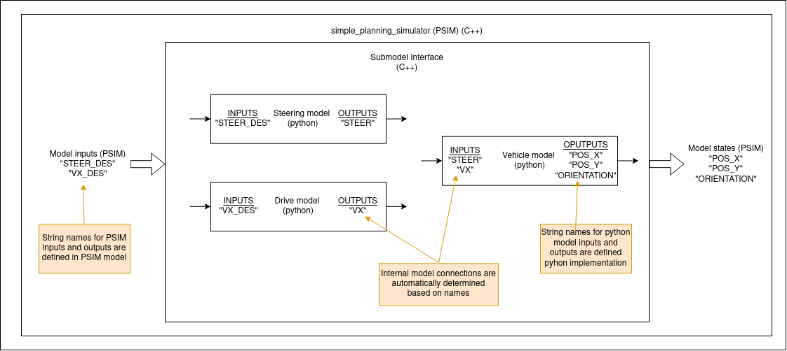

# 学習済みモデル

これは `simple_planning_simulator` パッケージで使用される Python 学習済みモデルの設計ドキュメントです。

## 目的/ ユースケース

<!-- Required -->
<!-- Things to consider:
    - Why did we implement this feature? -->

このライブラリは Python のモデルと PSIM (C++) のインターフェイスを作成します。複雑な C++ 実装を必要とせずに、学習した Python モデルを PSIM に素早くデプロイするために使用されます。

## 設計

<!-- Required -->
<!-- Things to consider:
    - How does it work? -->

このパッケージの背後にある考え方は、シミュレーションに使用したいモデルが、複数のサブモデル (例: ステアリングモデル、ドライブモデル、車両運動学など) で構成されていることです。これらのサブモデルは Python で実装されており、トレーニング可能です。各サブモデルは、すべての入力/出力の文字列名を持ち、それを使用してモデルの相互接続を自動的に作成します (下の画像を参照)。これにより、サブモデルを簡単に切り替えてシミュレーターをより詳細にカスタマイズできます。



## 想定事項 / 制約事項

<!-- Required -->

このパッケージを使用するには `python3` と `pybind11` をインストールする必要があります。Python サブモデルの唯一の想定事項は、それらのインターフェイスです。


```python
class PythonSubmodelInterface:

    def forward(self, action, state):  # Required
        """
        Calculate forward pass through the model and returns next_state.
        """
        return list()

    def get_state_names(self):  # Required
        """
        Return list of string names of the model states (outputs).
        """
        return list()

    def get_action_names(self):  # Required
        """
        Return list of string names of the model actions (inputs).
        """
        return list()

    def reset(self):  # Required
        """
        Reset model. This function is called after load_params().
        """
        pass

    def load_params(self, path):  # Required
        """
        Load parameters of the model.
        Inputs:
            - path: Path to a parameter file to load by the model.
        """
        pass

    def dtSet(self, dt):  # Required
        """
        Set dt of the model.
        Inputs:
            - dt: time step
        """
        pass
```

## API

<!-- Required -->
<!-- Things to consider:
    - How do you use the package / API? -->

車載モデルを正しく作成するには、InterconnectedModel クラスを正しくセットアップする必要があります。

### InterconnectedModel クラス

#### `コンストラクタ`

コンストラクタは引数を取りません。

#### `void addSubmodel(std::tuple<std::string, std::string, std::string> model_descriptor)`

モデルに新しいサブモデルを追加します。

入力:

- model_descriptor: 使用するモデルを記述します。モデル記述子には 3 つの文字列が含まれます。
  - 最初の文字列は、モデルが実装されている Python モジュールのパスです。
  - 2 番目の文字列は、モデルパラメータが格納されているファイルへのパスです。
  - 3 番目の文字列は、モデルを実装するクラスの名前です。

出力:

- なし

#### `void generateConnections(std::vector<char *> in_names, std::vector<char*> out_names)`

サブモデルとモデルの入力/出力との間の接続を生成します。

入力:

- in_names: すべてのモデル入力の文字列名（順番）。
- out_names: すべてのモデル出力の文字列名（順番）。

出力:

- なし

#### `void initState(std::vector<double> new_state)`

モデルの初期状態を設定します。

入力:

- new_state: モデルの新しい状態。

出力:

- なし

#### `std::vector<double> updatePyModel(std::vector<double> psim_input)`

すべてのサブモデルの次の状態を計算して、モデルの次の状態を計算します。

- psim_input: モデルへの入力。

出力:

- next_state: モデルの次の状態。

#### `dtSet(double dt)`

モデルのタイムステップを設定します。

入力:

- dt: タイムステップ

出力:

- なし

### 使用例

まず、モデルを設定する必要があります。


```C++
InterconnectedModel vehicle;

// Example of model descriptors
std::tuple<char*, char*, char*> model_descriptor_1 = {
    (char*)"path_to_python_module_with_model_class_1",
    (char*)nullptr,  // If no param file is needed you can pass 'nullptr'
    (char*)"ModelClass1"
    };

std::tuple<char*, char*, char*> model_descriptor_2 =   {
    (char*)"path_to_python_module_with_model_class_2",
    (char*)"/path_to/param_file",
    (char*)"ModelClass2"  // Name of the python class. Needs to use the interface from 'Assumptions'
    };

// Create sub-models based on descriptors
vehicle.addSubmodel(model_descriptor_1);
vehicle.addSubmodel(model_descriptor_2);

// Define STATE and INPUT names of the system
std::vector<char*> state_names = {(char*)"STATE_NAME_1", (char*)"STATE_NAME_2"};
std::vector<char*> input_names = {(char*)"INPUT_NAME_1", (char*)"INPUT_NAME_2"};

// Automatically connect sub-systems with model input
vehicle.generateConnections(input_names, state_names);

// Set the time step of the model
vehicle.dtSet(dt);
```

モデルの正しい設定が済んだら、以下のようにして使用できます。


```C++
// Example of an model input
std::vector<double> vehicle_input = {0.0, 1.0}; // INPUT_NAME_1, INPUT_NAME_2

// Example of an model state
std::vector<double> current_state = {0.2, 0.5}; // STATE_NAME_1, STATE_NAME_2

// Set model state
vehicle.initState(current_state);

// Calculate the next state of the model
std::vector<double> next_state = vehicle.updatePyModel(vehicle_input);
```

## 参照 / 外部リンク

<!-- Optional -->

## 関連課題

<!-- Required -->

