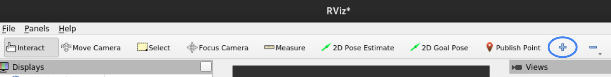
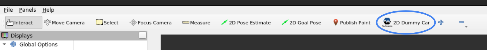
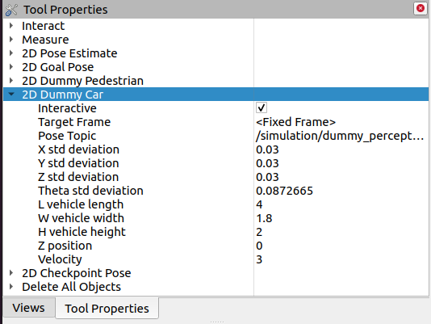

# tier4_dummy_object_rviz_plugin

## 目的

このプラグインは、プランニングシミュレータにダミーの歩行者、車、障害物を生成するために使用されます。

## 概要

CarInitialPoseToolは、ダミーの車を生成するためのトピックを送信します。  
PedestrianInitialPoseToolは、ダミーの歩行者を生成するためのトピックを送信します。  
UnknownInitialPoseToolは、ダミーの障害物を生成するためのトピックを送信します。  
DeleteAllObjectsToolは、上記の3つのツールで表示されるダミーの車、歩行者、障害物を削除します。

## 入出力

### 出力

| 名前                                                 | タイプ                                      | 説明                                        |
| ---------------------------------------------------- | ----------------------------------------- | -------------------------------------------- |
| `/simulation/dummy_perception_publisher/object_info` | `tier4_simulation_msgs::msg::DummyObject` | ダミーオブジェクト情報を発行するトピック |

## パラメータ

### コアパラメータ

#### 自車位置

| 名称              | タイプ   | デフォルト値                                        | 説明                                       |
| ----------------- | ------ | ---------------------------------------------------- | -------------------------------------------- |
| `topic_property_` | 文字列 | `/simulation/dummy_perception_publisher/object_info` | ダミーオブジェクト情報をパブリッシュするトピック |
| `std_dev_x_`      | 浮動小数点 | 0.03                                                 | 初期姿勢の X 標準偏差 [m]                   |
| `std_dev_y_`      | 浮動小数点 | 0.03                                                 | 初期姿勢の Y 標準偏差 [m]                   |
| `std_dev_z_`      | 浮動小数点 | 0.03                                                 | 初期姿勢の Z 標準偏差 [m]                   |
| `std_dev_theta_`  | 浮動小数点 | 5.0 \* M_PI / 180.0                                  | 初期姿勢の Theta 標準偏差 [rad]             |
| `length_`         | 浮動小数点 | 4.0                                                  | 初期姿勢の X 標準偏差 [m]                   |
| `width_`          | 浮動小数点 | 1.8                                                  | 初期姿勢の Y 標準偏差 [m]                   |
| `height_`         | 浮動小数点 | 2.0                                                  | 初期姿勢の Z 標準偏差 [m]                   |
| `position_z_`     | 浮動小数点 | 0.0                                                  | 初期姿勢の Z 位置 [m]                         |
| `velocity_`       | 浮動小数点 | 0.0                                                  | 速度 [m/s]                                   |

#### BusPose

| Name              | Type   | デフォルト値                                         | 説明                                     |
| ----------------- | ------ | ---------------------------------------------------- | ----------------------------------------------- |
| `topic_property_` | 文字列 | `/simulation/dummy_perception_publisher/object_info` | ダミーオブジェクト情報をパブリッシュするトピック |
| `std_dev_x_`      | 数値   | 0.03                                                 | 初期ポーズでの X 方向の標準偏差 [m]       |
| `std_dev_y_`      | 数値   | 0.03                                                 | 初期ポーズでの Y 方向の標準偏差 [m]       |
| `std_dev_z_`      | 数値   | 0.03                                                 | 初期ポーズでの Z 方向の標準偏差 [m]       |
| `std_dev_theta_`  | 数値   | 5.0 \* M_PI / 180.0                                  | 初期ポーズでの Theta 方向の標準偏差 [rad] |
| `length_`         | 数値   | 10.5                                                 | 初期ポーズでの X 方向の標準偏差 [m]       |
| `width_`          | 数値   | 2.5                                                  | 初期ポーズでの Y 方向の標準偏差 [m]       |
| `height_`         | 数値   | 3.5                                                  | 初期ポーズでの Z 方向の標準偏差 [m]       |
| `position_z_`     | 数値   | 0.0                                                  | 初期ポーズでの Z 方向の位置 [m]                 |
| `velocity_`       | 数値   | 0.0                                                  | Velocity [m/s]                                  |

#### PedestrianPose

| 名              | 型   | デフォルト値                                       | 説明                                       |
| ----------------- | ------ | --------------------------------------------------- | -------------------------------------------- |
| `topic_property_` | 文字列 | `/simulation/dummy_perception_publisher/object_info` | ダミー物体情報をパブリッシュするトピック |
| `std_dev_x_`      | 実数  | 0.03                                                | X の初期姿勢に対する標準偏差 [m]       |
| `std_dev_y_`      | 実数  | 0.03                                                | Y の初期姿勢に対する標準偏差 [m]       |
| `std_dev_z_`      | 実数  | 0.03                                                | Z の初期姿勢に対する標準偏差 [m]       |
| `std_dev_theta_`  | 実数  | 5.0 \* M_PI / 180.0                               | Theta の初期姿勢に対する標準偏差 [rad] |
| `position_z_`     | 実数  | 0.0                                                 | Z 位置に対する初期姿勢 [m]                |
| `velocity_`       | 実数  | 0.0                                                 | 速度 [m/s]                                 |

#### 未知車位置

| 名称              | タイプ   | 初期値                                        | 説明                                     |
| ----------------- | ------ | ---------------------------------------------------- | ----------------------------------------------- |
| `topic_property_` | 文字列 | `/simulation/dummy_perception_publisher/object_info` | ダミーオブジェクト情報をパブリッシュするトピック |
| `std_dev_x_`      | 浮動小数 | 0.03                                                 | 初期位置の X の標準偏差 [m]       |
| `std_dev_y_`      | 浮動小数 | 0.03                                                 | 初期位置の Y の標準偏差 [m]       |
| `std_dev_z_`      | 浮動小数 | 0.03                                                 | 初期位置の Z の標準偏差 [m]       |
| `std_dev_theta_`  | 浮動小数 | 5.0 \* M_PI / 180.0                                  | 初期位置の θ の標準偏差 [rad] |
| `position_z_`     | 浮動小数 | 0.0                                                  | 初期位置の Z 位置 [m]                 |
| `velocity_`       | 浮動小数 | 0.0                                                  | 速度 [m/s]                                  |

#### DeleteAllObjects

| Name              | Type   | Default Value                                       | Description                                  |
| ----------------- | ------ | ------------------------------------------------------ | --------------------------------------------- |
| `topic_property_` | string | `/simulation/dummy_perception_publisher/object_info` | ダミーオブジェクト情報をパブリッシュするトピック |

## 想定/既知の制限

Planningシミュレータを使用

## 使用方法

1. rvizを起動し、ツールタブで+を選択します。
   
2. tier4_dummy_object_rviz_pluginのいずれかを選択し、OKを押します。
   
3. ツールタブで新しいアイテム（例では2Dダミーカー）を選択し、rvizでクリックします。
   

### 対話操作

オブジェクトは対話的に操作できます。

1. rvizで「ツールプロパティ」を選択します。
2. ツールプロパティで対応するオブジェクトタブを選択します。
3. 「インタラクティブ」チェックボックスをオンにします。
   
4. まだ選択していない場合、ツールタブでアイテムを選択します。
5. キーコマンドは次のとおりです。

## 自動運転ソフトウェア ドキュメント 翻訳

### Planning コンポーネント

| アクション | キーコマンド |
|---|---|
| 追加 (ADD) | Shift キーを押しながら右クリック |
| 移動 (MOVE) | 右クリックをホールドしたままドラッグアンドドロップ |
| 削除 (DELETE) | Alt キーを押しながら右クリック |

### Common API

```
# Maneuver Lane Route
lane_route: LCRLaneletIDProto
# <long> self.pose[0] 自車位置 *post resampling*[m]; current pose[1] 自車位置 [m/s]
pose             : geometry_msgs/PoseStampedWithCovariance
# `-1`; GPS, IMU, etc
source: int32
```

## Material Design アイコン

このプロジェクトでは、Google の [Material Design アイコン](https://developers.google.com/fonts/docs/material_symbols) を使用しています。これらのアイコンは、Apache ライセンスバージョン 2.0 の条件に基づいて使用されています。

Material Design アイコンは、Google が提供するシンボルのコレクションで、アプリケーション、Web サイト、その他のデジタル製品のユーザーインターフェイスを向上させるために使用されます。

### ライセンス

Material Design アイコンは、Apache ライセンスバージョン 2.0 のもとでライセンスされています。ライセンスのコピーは次の URL から入手できます。

<http://www.apache.org/licenses/LICENSE-2.0>

適用法で求められる場合または書面で同意しない限り、ライセンスに基づいて配布されるソフトウェアは、明示的または黙示的な保証なしで「そのまま」配布されます。ライセンスの具体的な許可および制限事項については、ライセンスを参照してください。

### 謝辞

コミュニティにこれらのアイコンを提供し、開発者やデザイナーがプロジェクトのビジュアルアピールとユーザーエクスペリエンスを向上させることを支援してくれる Google に感謝の意を表したいと思います。

