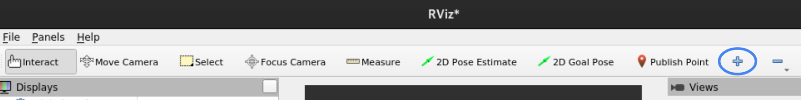
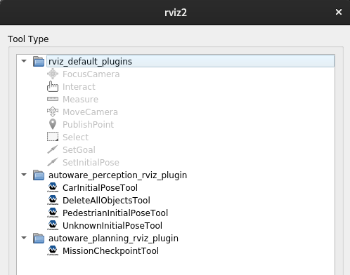
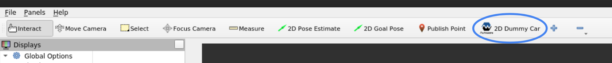
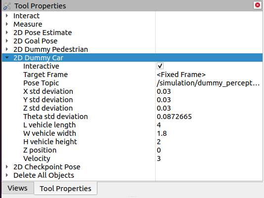

# tier4_dummy_object_rviz_plugin

## Purpose

This plugin is used to generate dummy pedestrians, cars, and obstacles in planning simulator.

## Overview

The CarInitialPoseTool sends a topic for generating a dummy car.
The PedestrianInitialPoseTool sends a topic for generating a dummy pedestrian.
The UnknownInitialPoseTool sends a topic for generating a dummy obstacle.
The StaticInitialPoseTool sends a topic for generating dummy static-area point clouds with a `PointCloudClassification` label.
The DeleteAllObjectsTool deletes the dummy cars, pedestrians, obstacles, and static area point clouds.

The StaticInitialPoseTool uses `tier4_simulation_msgs::msg::DummyObject` on a dedicated static area topic. On this topic only, `classification.label` stores a `PointCloudClassification` value.

## Inputs / Outputs

### Output

| Name                                                 | Type                                      | Description                                     |
| ---------------------------------------------------- | ----------------------------------------- | ----------------------------------------------- |
| `/simulation/dummy_perception_publisher/object_info` | `tier4_simulation_msgs::msg::DummyObject` | The topic on which to publish dummy object info |
| `/simulation/dummy_perception_publisher/static_area` | `tier4_simulation_msgs::msg::DummyObject` | The topic on which to publish dummy static area info |

## Parameter

### Core Parameters

#### CarPose

| Name              | Type   | Default Value                                        | Description                                     |
| ----------------- | ------ | ---------------------------------------------------- | ----------------------------------------------- |
| `topic_property_` | string | `/simulation/dummy_perception_publisher/object_info` | The topic on which to publish dummy object info |
| `std_dev_x_`      | float  | 0.03                                                 | X standard deviation for initial pose [m]       |
| `std_dev_y_`      | float  | 0.03                                                 | Y standard deviation for initial pose [m]       |
| `std_dev_z_`      | float  | 0.03                                                 | Z standard deviation for initial pose [m]       |
| `std_dev_theta_`  | float  | 5.0 \* M_PI / 180.0                                  | Theta standard deviation for initial pose [rad] |
| `length_`         | float  | 4.0                                                  | X standard deviation for initial pose [m]       |
| `width_`          | float  | 1.8                                                  | Y standard deviation for initial pose [m]       |
| `height_`         | float  | 2.0                                                  | Z standard deviation for initial pose [m]       |
| `position_z_`     | float  | 0.0                                                  | Z position for initial pose [m]                 |
| `velocity_`       | float  | 0.0                                                  | Velocity [m/s]                                  |

#### BusPose

| Name              | Type   | Default Value                                        | Description                                     |
| ----------------- | ------ | ---------------------------------------------------- | ----------------------------------------------- |
| `topic_property_` | string | `/simulation/dummy_perception_publisher/object_info` | The topic on which to publish dummy object info |
| `std_dev_x_`      | float  | 0.03                                                 | X standard deviation for initial pose [m]       |
| `std_dev_y_`      | float  | 0.03                                                 | Y standard deviation for initial pose [m]       |
| `std_dev_z_`      | float  | 0.03                                                 | Z standard deviation for initial pose [m]       |
| `std_dev_theta_`  | float  | 5.0 \* M_PI / 180.0                                  | Theta standard deviation for initial pose [rad] |
| `length_`         | float  | 10.5                                                 | X standard deviation for initial pose [m]       |
| `width_`          | float  | 2.5                                                  | Y standard deviation for initial pose [m]       |
| `height_`         | float  | 3.5                                                  | Z standard deviation for initial pose [m]       |
| `position_z_`     | float  | 0.0                                                  | Z position for initial pose [m]                 |
| `velocity_`       | float  | 0.0                                                  | Velocity [m/s]                                  |

#### PedestrianPose

| Name              | Type   | Default Value                                        | Description                                     |
| ----------------- | ------ | ---------------------------------------------------- | ----------------------------------------------- |
| `topic_property_` | string | `/simulation/dummy_perception_publisher/object_info` | The topic on which to publish dummy object info |
| `std_dev_x_`      | float  | 0.03                                                 | X standard deviation for initial pose [m]       |
| `std_dev_y_`      | float  | 0.03                                                 | Y standard deviation for initial pose [m]       |
| `std_dev_z_`      | float  | 0.03                                                 | Z standard deviation for initial pose [m]       |
| `std_dev_theta_`  | float  | 5.0 \* M_PI / 180.0                                  | Theta standard deviation for initial pose [rad] |
| `position_z_`     | float  | 0.0                                                  | Z position for initial pose [m]                 |
| `velocity_`       | float  | 0.0                                                  | Velocity [m/s]                                  |

#### UnknownPose

| Name              | Type   | Default Value                                        | Description                                     |
| ----------------- | ------ | ---------------------------------------------------- | ----------------------------------------------- |
| `topic_property_` | string | `/simulation/dummy_perception_publisher/object_info` | The topic on which to publish dummy object info |
| `std_dev_x_`      | float  | 0.03                                                 | X standard deviation for initial pose [m]       |
| `std_dev_y_`      | float  | 0.03                                                 | Y standard deviation for initial pose [m]       |
| `std_dev_z_`      | float  | 0.03                                                 | Z standard deviation for initial pose [m]       |
| `std_dev_theta_`  | float  | 5.0 \* M_PI / 180.0                                  | Theta standard deviation for initial pose [rad] |
| `position_z_`     | float  | 0.0                                                  | Z position for initial pose [m]                 |
| `velocity_`       | float  | 0.0                                                  | Velocity [m/s]                                  |

#### StaticPose

| Name                    | Type   | Default Value                                           | Description                                             |
| ----------------------- | ------ | ------------------------------------------------------- | ------------------------------------------------------- |
| `topic_property_`       | string | `/simulation/dummy_perception_publisher/static_area`  | The topic on which to publish dummy static area info  |
| `class_property_`       | enum   | `VEGETATION`                                            | Point class defined by `autoware::point_types::PointCloudClassification` |
| `std_dev_x_`            | float  | 0.03                                                    | X standard deviation for initial pose [m]              |
| `std_dev_y_`            | float  | 0.03                                                    | Y standard deviation for initial pose [m]              |
| `std_dev_z_`            | float  | 0.03                                                    | Z standard deviation for initial pose [m]              |
| `std_dev_theta_`        | float  | 5.0 \* M_PI / 180.0                                     | Theta standard deviation for initial pose [rad]        |
| `position_z_`           | float  | 0.0                                                     | Z position for initial pose [m]                        |
| `length_`               | float  | 0.8                                                     | Length of the static area [m]                          |
| `width_`                | float  | 0.8                                                     | Width of the static area [m]                           |
| `height_`               | float  | 2.0                                                     | Height of the static area [m]                          |

#### DeleteAllObjects

| Name              | Type   | Default Value                                        | Description                                     |
| ----------------- | ------ | ---------------------------------------------------- | ----------------------------------------------- |
| `topic_property_` | string | `/simulation/dummy_perception_publisher/object_info` | The topic on which to publish dummy object info |
| `static_area_topic_property_` | string | `/simulation/dummy_perception_publisher/static_area` | The topic on which to publish dummy static area info |

## Assumptions / Known limits

Using a planning simulator

## Usage

1. Start rviz and select + on the tool tab.
   
2. Select one of the following: tier4_dummy_object_rviz_plugin and press OK.
   
3. Select the new item in the tool tab (2D Dummy Car in the example) and click on it in rviz.
   

### Interactive manipulation

You can interactively manipulate the object.

1. Select "Tool Properties" in rviz.
2. Select the corresponding object tab in the Tool Properties.
3. Turn the "Interactive" checkbox on.
   
4. Select the item in the tool tab in you haven't chosen yet.
5. Key commands are as follows.

| action | key command                            |
| ------ | -------------------------------------- |
| ADD    | Shift + Click Right Button             |
| MOVE   | Hold down Right Button + Drag and Drop |
| DELETE | Alt + Click Right Button               |

### Static pose

You can place a static box for semantic point cloud generation.

1. Select "2D Dummy Static Area" in the tool tab.
2. Select a non-object-compatible class from `Point Class` in the Tool Properties.
3. Set `Length`, `Width`, and `Height` in the Tool Properties.
4. Click and drag in RViz like the other 2D dummy object tools.

The tool publishes `tier4_simulation_msgs::msg::DummyObject` with `shape.type = BOUNDING_BOX`.
Only on the static area topic, `classification.label` is interpreted as
`autoware::point_types::PointCloudClassification`.
Object-compatible `PointCloudClassification` labels are not shown in `Point Class`.
`DeleteAllObjectsTool` also publishes `DELETEALL` to the static area topic, so static area point
clouds are cleared together with dummy objects.

## Material Design Icons

This project uses [Material Design Icons](https://developers.google.com/fonts/docs/material_symbols) by Google. These icons are used under the terms of the Apache License, Version 2.0.

Material Design Icons are a collection of symbols provided by Google that are used to enhance the user interface of applications, websites, and other digital products.

### License

The Material Design Icons are licensed under the Apache License, Version 2.0. You may obtain a copy of the License at:

<http://www.apache.org/licenses/LICENSE-2.0>

Unless required by applicable law or agreed to in writing, software distributed under the License is distributed on an "AS IS" BASIS, WITHOUT WARRANTIES OR CONDITIONS OF ANY KIND, either express or implied. See the License for the specific language governing permissions and limitations under the License.

### Acknowledgments

We would like to express our gratitude to Google for making these icons available to the community, helping developers and designers enhance the visual appeal and user experience of their projects.
