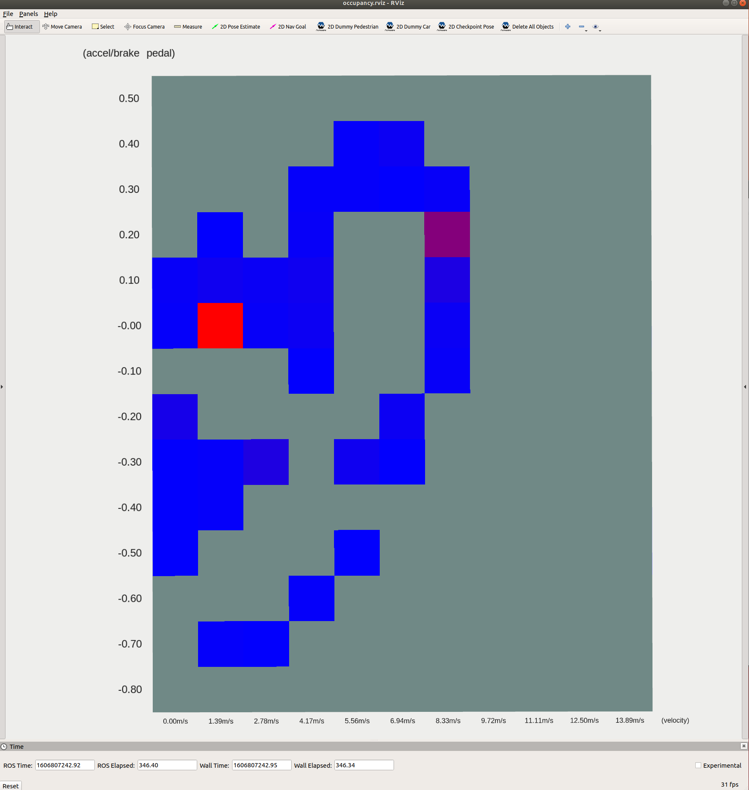
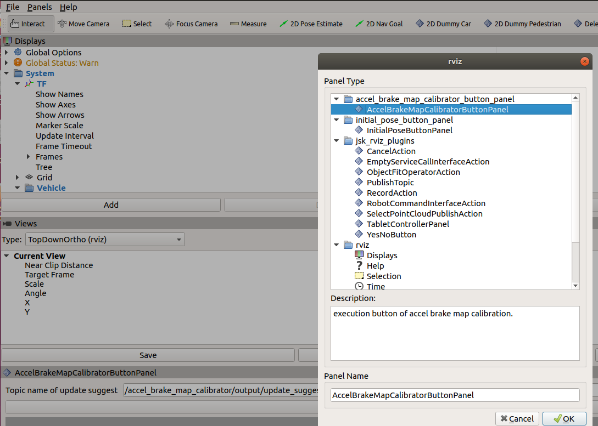
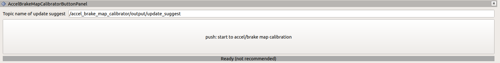
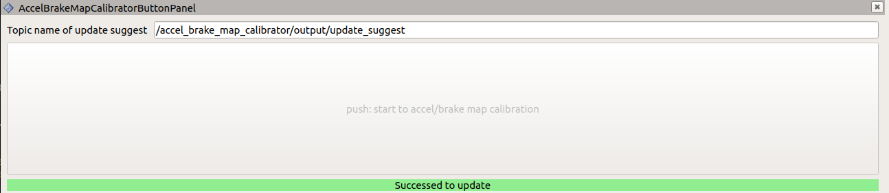
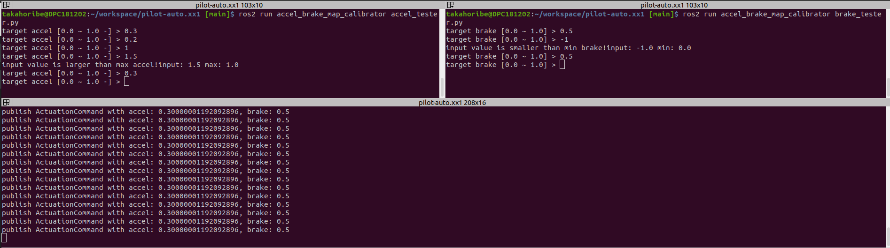
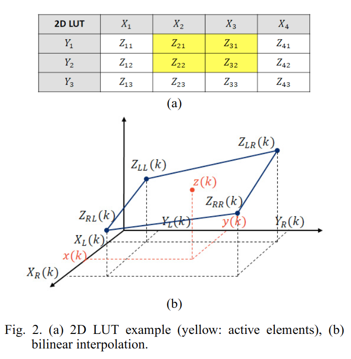

# accel_brake_map_calibrator

このノードの役割は、`autoware_raw_vehicle_cmd_converter`ノードで使用される`accel_map.csv` / `brake_map.csv` を自動的に較正することです。

デフォルトでレクサスの基本マップがロードされた走行データで反復的に更新されます。

## 較正方法

### キャリブレーターの起動

Autowareを起動した後、次のコマンドで`autoware_accel_brake_map_calibrator`を実行し、自動運転を実施します。注: 自動運転時と同じ車両インターフェイスを使用できる場合（例: ジョイスティックを使用する場合）は、手動運転でデータを収集できます。


```sh
ros2 launch autoware_accel_brake_map_calibrator accel_brake_map_calibrator.launch.xml rviz:=true
```

ROSbagファイルを使用する場合は、以下のコマンドを実行してください。


```sh
ros2 launch autoware_accel_brake_map_calibrator accel_brake_map_calibrator.launch.xml rviz:=true use_sim_time:=true
ros2 bag play <rosbag_file> --clock
```

キャリブレーションでパラメータ`progress_file_output`をtrueに設定すると、ログファイルは[autoware_accel_brake_map_calibrator*ディレクトリ]/config/に出力されます。キャリブレーション後は、[autoware_accel_brake_map_calibrator*ディレクトリ]/config/accel_map.csvおよび[autoware_accel_brake_map_calibrator*ディレクトリ]/config/brake_map.csvでアクセルとブレーキのマップを確認することもできます。

### キャリブレーションプラグイン

`rviz:=true`オプションは、以下のようにキャリブレーションプラグイン付きのRVizを表示します。

<p align="center">

</p>

現在の状態（速度とペダル）はプラグインに表示されます。現在のセルの色は、現在のデータが有効/無効に応じて緑色/赤色に変化します。次のような条件を満たさないデータは無効とみなされ、推定に使用されません。積極的なデータ（例: ペダルが高速で動いている場合）が不十分なキャリブレーション精度を引き起こすためです。

- 速度とペダルの状態は、インデックス値からの特定の範囲内にある。
- ステア値、ペダル速度、ピッチ値などが対応するしきい値よりも小さい。
- 速度はしきい値より大きい。

詳細なパラメータは、パラメータセクションで説明されています。

注意: キャリブレーション中は、現在の状態が赤または緑であるかどうかを心配する必要はありません。すべてのセルが赤くなるまでデータを収集し続けるだけです。

マップの各セルの値は最初はグレーで、セルの有効なデータの数が蓄積されると青から赤に変化します。マップの各セルが赤に近づくまでキャリブレーションを続行することをお勧めします。特に停止時の性能は0～6m/sの速度と+0.2～-0.4のペダル値の範囲に大きく依存するため、これらの領域に焦点を当てることが望まれます。

### 診断

`accel brake map_calibrator`は、キャリブレーションステータスに応じて診断メッセージを発行します。診断タイプ`WARN`は、現在のアクセル/ブレーキマップが不正確であると推定されることを示します。この状況では、accel/ブレーキマップの再キャリブレーションを実行することを強くお勧めします。

| 状態                  | 診断タイプ | 診断メッセージ                        | 説明                                             |
| ----------------------- | ---------------- | ------------------------------------------ | --------------------------------------------------- |
| キャリブレーション不要 | `OK`             | "OK"                                       |                                                     |
| キャリブレーション必要 | `WARN`           | "アクセル/ブレーキマップのキャリブレーションが必要です。" | 現在のアクセル/ブレーキマップの精度は低いかもしれません。 |

この診断ステータスは、次のROSトピックでも確認できます。


```sh
ros2 topic echo /accel_brake_map_calibrator/output/update_suggest
```

診断の種類が `WARN` の場合、True がこのトピックにパブリッシュされ、アクセル/ブレーキマップの更新が推奨されます。

### アクセル / ブレーキマップ精度の評価

マップの精度は、観測加速度と予測加速度の **二乗平均平方根誤差 (RMSE)** で評価されます。

**用語:**

- `観測加速度`: 車輪速度の導関数として計算された現在の車両加速度。

- `予測加速度`: Autoware が期待する元のアクセル/ブレーキマップの出力。この値は現在のペダルと速度を使用して計算されます。

次のトピックで追加のエラー情報をチェックできます。

- `/accel_brake_map_calibrator/output/current_map_error` : `csv_path_accel/brake_map` パスに設定された元のマップのエラー。この値が大きい場合、元のマップは正確ではありません。
- `/accel_brake_map_calibrator/output/updated_map_error` : このノードでキャリブレーションされたマップのエラー。この値が大きい場合、キャリブレーションの品質は低くなります。
- `/accel_brake_map_calibrator/output/map_error_ratio` : 元のマップと更新されたマップのエラー比 (ratio = updated / current)。この値が 1 未満の場合、マップを更新することをお勧めします。

### キャリブレーションデータの視覚化方法

キャリブレーションの処理は次のように視覚化できます。これらのスクリプトにはキャリブレーションのログ出力が必要なので、視覚化のためにキャリブレーションを実行中は `pedal_accel_graph_output` パラメーターを true に設定する必要があります。

#### 加速度とペダル間の関係のグラフを視覚化

次のコマンドは、キャリブレーションで使用されるデータのグラフを表示します。速度範囲の各グラフには、ペダルと加速度の関係の分布と、ピッチ角に応じた色の付いた生のデータポイントが表示されます。


```sh
ros2 run autoware_accel_brake_map_calibrator view_plot.py
```

#### 加速度/速度/ペダル データに関する統計値を可視化する

次のコマンドは、キャリブレーションの統計値を示します。

- 平均値
- 標準偏差
- データ数

各マップセルの全データの値です。


```sh
ros2 run autoware_accel_brake_map_calibrator view_statistics.py
```

### アクセルとブレーキの較正済みマップの随時保存方法

以下のコマンドを使用して、アクセルとブレーキのマップを随時に保存できます。


```sh
ros2 service call /accel_brake_map_calibrator/update_map_dir tier4_vehicle_msgs/srv/UpdateAccelBrakeMap "path: '<accel/brake map directory>'"
```

以下の手順で、Autowareが accel_map.csv/brake_map.csv を読み込む既定のディレクトリに、アクセルおよびブレーキマップを RViz プラグイン (AccelBrakeMapCalibratorButtonPanel) を使用して保存できます。

1. _パネル_タブをクリックし、AccelBrakeMapCalibratorButtonPanel を選択します。

   

2. パネルを選択すると、ボタンが RViz の下部に表示されます。

   

3. ボタンを押すと、アクセル/ブレーキマップが保存されます。
   (キャリブレーターノードが実行中でないなどの状況では、ボタンを押せません。)

   

## パラメーター

## システムパラメーター

| 名目                     | 型   | 説明                                                                                                                                                                       | デフォルト値                                                     |
| :----------------------- | :----- | :-------------------------------------------------------------------------------------------------------------------------------------------------------------------------------- | :---------------------------------------------------------------- |
| update_method            | 文字列 | 地図較正手法を選択できます。"update_offset_each_cell" は地図上の各グリッドセルのオフセットを計算します。"update_offset_total" は地図の総オフセットを計算します。 | "update_offset_each_cell"                                         |
| get_pitch_method         | 文字列 | "tf": tfからピッチを取得、"none": ピッチ検証およびピッチ補正を実行できません                                                                                        | "tf"                                                              |
| pedal_accel_graph_output | ブール | trueの場合、アクセルグラフのログが出力されます。                                                                                                                           | true                                                              |
| progress_file_output     | ブール | trueの場合、更新プロセスのログとcsvファイルが出力されます。                                                                                                                 | false                                                             |
| default_map_dir          | 文字列 | デフォルトマップのディレクトリ                                                                                                                                                       | [directory of *autoware_raw_vehicle_cmd_converter*]/data/default/ |
| calibrated_map_dir       | 文字列 | 校正済み地図のディレクトリ                                                                                                                                                       | [directory of *autoware_accel_brake_map_calibrator*]/config/      |
| update_hz                | double | 更新のhz                                                                                                                                                                     | 10.0                                                              |

## アルゴリズムパラメータ

| 名前                     | タイプ   | 説明                                                                                                                                         | デフォルト値 |
| :----------------------- | :----- | :-------------------------------------------------------------------------------------------------------------------------------------------------- | :------------ |
| initial_covariance       | double | 初期加速度マップの共分散（共分散が大きいほど、更新速度が速くなる）                                                                                | 0.05          |
| velocity_min_threshold   | double | この閾値より小さい速度は更新に使用されません。                                                                                                 | 0.1           |
| velocity_diff_threshold  | double | 速度データがグリッド基準速度（中央値）からこの閾値以上離れている場合、関連データは更新に使用されません。                                      | 0.556         |
| max_steer_threshold      | double | ステアリングアングルがこの値を超えると、関連データは更新に使用されません。                                                                         | 0.2           |
| max_pitch_threshold      | double | ピッチアングルがこの値を超えると、関連データは更新に使用されません。                                                                         | 0.02          |
| max_jerk_threshold       | double | 自己位置から計算された自己ジャークがこの値を超えると、関連データは更新に使用されません。                                                      | 0.7           |
| pedal_velocity_thresh    | double | ペダル移動速度がこの値を超えると、関連データは更新に使用されません。                                                                             | 0.15          |
| pedal_diff_threshold     | double | 現在のペダル値が前の値からこの閾値以上離れている場合、関連データは更新に使用されません。                                                | 0.03          |
| max_accel                | double | 速度ソースから計算された加速度の最大値。                                                                                                    | 5.0           |
| min_accel                | double | 速度ソースから計算された加速度の最小値。                                                                                                    | -5.0          |
| pedal_to_accel_delay     | double | 更新ロジックで考慮される、actuation_cmd から加速度までの遅延時間。                                                                         | 0.3           |
| update_suggest_thresh    | double | RMSE 比が真の更新フラグになる閾値。 (RMSE 比: [新しいマップの RMSE] / [元のマップの RMSE] )                                                     | 0.7           |
| max_data_count           | int    | 視覚化向け。各グリッドのデータ数がこの値になると、グリッドの色が赤くなります。                                                                 | 100           |
| accel_brake_value_source | string | 加速度/ブレーキのソースとして、actuation_status または actuation_command のどちらを使用するか。値                                               | status        |

## テストユーティリティスクリプト

### 定常加/減速コマンドテスト

これらのスクリプトは、加速度/ブレーキマップのキャリブレーションをテストするために役立ちます。これらは、ユーザーがCLIを介してインタラクティブに指定した定常加/減速度値を持つ`ActuationCmd`を生成します。

- accel_tester.py
- brake_tester.py
- actuation_cmd_publisher.py

`accel/brake_tester.py`は、CLIからターゲット加速度/ブレーキコマンドを受信します。ターゲット値を`actuation_cmd_publisher.py`に送信し、それによって`ActuationCmd`が生成されます。次のコマンドを別の端末で実行してこれらのスクリプトを実行できます。以下にスクリーンショットを示します。


```bash
ros2 run autoware_accel_brake_map_calibrator accel_tester.py
ros2 run autoware_accel_brake_map_calibrator brake_tester.py
ros2 run autoware_accel_brake_map_calibrator actuation_cmd_publisher.py
```



## キャリブレーション方法

2つのアルゴリズム（[update_offset_four_cell_around](#update_offset_four_cell_around-1)と[update_offset_each_cell](#update_offset_each_cell)）が加速度マップ更新用に選択できます。詳細はリンクを参照してください。

### データの前処理

キャリブレーションの前に、不完全または使用できないデータ（例：ハンドル角度が大きすぎるなど）を最初に排除する必要があります。以下のパラメータは、削除するデータの決定に使用されます。

#### パラメータ

| 名前                  | 説明                          | デフォルト値 |
|--------------------------|----------------------------------|---------------|
| velocity_min_threshold | 最小速度を除外                   | 0.1           |
| max_steer_threshold    | 大きな操舵角を除外               | 0.2           |
| max_pitch_threshold    | 大きなピッチ角を除外              | 0.02          |
| max_jerk_threshold     | 大きなジャークを除外              | 0.7           |
| pedal_velocity_thresh  | 大きなペダル速度を除外            | 0.15          |

### update_offset_each_cell

グリッドの近くに十分なデータを使用して、再帰的最小二乗法（RLS）手法で更新します。

**利点:** 各グリッドに十分に近いデータのみをキャリブレーションに使用するため、各ポイントで正確な更新が行えます。

**欠点:** 除外するデータ量が多いため、キャリブレーションに時間がかかります。

#### パラメータ

データの選択は、次のしきい値によって決定されます。

| 名称 | デフォルト値 |
| ----------------------- | ------------- |
| velocity_diff_threshold | 0.556 |
| pedal_diff_threshold | 0.03 |

#### 更新式

$$
\begin{align}
    \theta[n]=&
    \theta[n-1]+\frac{p[n-1]x^{(n)}}{\lambda+p[n-1]{(x^{(n)})}^2}(y^{(n)}-\theta[n-1]x^{(n)})\\
    p[n]=&\frac{p[n-1]}{\lambda+p[n-1]{(x^{(n)})}^2}
\end{align}
$$

#### 変数

| 変数名 | 記号 |
|---|---|
| 共分散 | $p[n-1]$ |
| マップオフセット | $\theta[n]$ |
| 減衰*係数* | $\lambda$ |
| フィー | $x(=1)$ |
| 計測加速度 | $y$ |

### update_offset_four_cell_around [1]

新しく取得したデータ周辺の4つのグリッドにおけるRLSによるオフセットの更新。線形補完を考慮することで、アップデートは適切な重み付けを考慮します。したがって、しきい値によりデータを削除する必要はありません。

**利点**: 適切な重み付けによりデータ周辺の4つのグリッドに対してアップデートが実行されるため、データが無駄になりません。
**欠点**: データの極端なバイアスにより、精度は低下する可能性があります。たとえば、図2でデータ$z(k)$が$Z_{RR}$付近でバイアスがかかっている場合、4つの周囲点($Z_{RR}$, $Z_{RL}$, $Z_{LR}$, $Z_{LL}$)で更新されますが、$Z_{LL}$の精度は期待できません。

<!-- cspell: ignore fourcell -->
<p align="center">
  
</p>

#### 実装

更新された数式については[1]のeq.(7)-(10)を参照してください。さらに、[1]のeq.(17)、(18)がアンチ・ワインドアップに使用されます。

### 参考資料

<!-- cspell: ignore Lochrie, Doljevic, Yongsoon, Yoon, IFAC -->

[1] [Gabrielle Lochrie, Michael Doljevic, Mario Nona, Yongsoon Yoon, Anti-Windup Recursive Least Squares Method for Adaptive Lookup Tables with Application to Automotive Powertrain Control Systems, IFAC-PapersOnLine, Volume 54, Issue 20, 2021, Pages 840-845](https://www.sciencedirect.com/science/article/pii/S240589632102320X)

