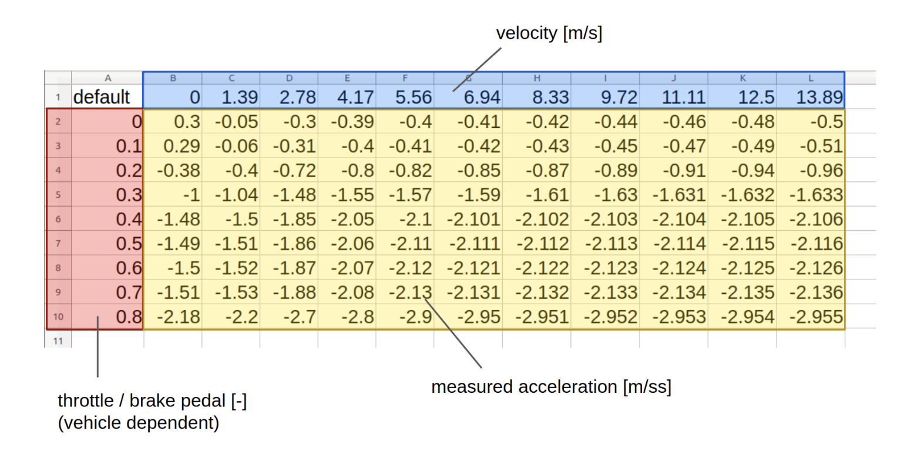
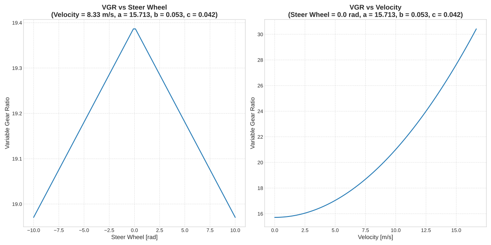

# autoware_raw_vehicle_cmd_converter

## 概要

raw_vehicle_command_converter は、自動運転システムにおける重要なノードであり、希望するステアリングとアクセル入力を入力に特定の車両制御コマンドに変換する役割を果たしています。このプロセスは、ルックアップテーブルとオプションのフィードバック制御システムを組み合わせることで実現されます。

### ルックアップテーブル

コンバーターの機能の中心は、CSV 形式のルックアップテーブルを使用することです。このテーブルには、スロットル／ブレーキペダル（車両制御インターフェースによって異なります）と、さまざまな速度における対応する車両加速度の関係がカプセル化されています。コンバーターはこのデータを利用して、目標加速度を適切なスロットル／ブレーキ値に正確に変換します。



### 参照データの作成

ルックアップテーブルの参照データは、次の手順で生成します。

1. **データの収集**: 平らな道路で、一定値のコマンド（例：スロットル／ブレーキペダル）を適用して車両を加速または減速させます。
2. **データの記録**: この段階では、IMU 加速度と車両速度の両方のデータを記録します。
3. **CSV ファイルの生成**: コマンド値、車両速度、および結果の加速度の関係を詳述した CSV ファイルを作成します。

加速度マップが作成されたら、RawVehicleCmdConverter ノードを起動するときにロードする必要があり、ファイルパスは起動ファイルで定義されます。

### 自動キャリブレーションツール

ルックアップテーブルのキャリブレーションと調整を容易にするために、自動キャリブレーションツールが用意されています。このツールの詳細と手順は [こちら](https://github.com/autowarefoundation/autoware.universe/blob/main/vehicle/autoware_accel_brake_map_calibrator/README.md) に記載されています。

### 可変ギア比 (VGR)

これは、タイヤ角からステアリング角に変換するためのギア比です。一般的に、操作性を向上させるために、速度が増大するにつれて、またはステアリング角が小さくなるとギア比は動的に大きくなります。特定の車両については、データが取得され、ギア比は次の数式で近似されました。

$$
a + b \times v^2 - c \times \lvert \delta \rvert
$$

その車両では、係数は次のとおりでした。


```yaml
vgr_coef_a: 15.713
vgr_coef_b: 0.053
vgr_coef_c: 0.042
```



`convert_steer_cmd_method: "vgr"` が選択されている場合、ノードはコントローラーからの制御コマンドを必要タイヤ角度として受信し、出力する必要ステアリング角度を計算します。また、`convert_actuation_to_steering_status: true` の場合、このノードは `actuation_status` トピックを受信し、`steer_wheel_angle` からステアタイヤ角度を計算してパブリッシュします。

## 入力トピック

| 名前                      | タイプ                                       | 説明                                                                                                                                                                                                                                                                                                                                                                                                                                                                                   |
| ------------------------- | ------------------------------------------ | ----------------------------------------------------------------------------------------------------------------------------------------------------------------------------------------------------------------------------------------------------------------------------------------------------------------------------------------------------------------------------------------------------------------------------------------------------------------------------------------------------------------------------------------------------------------------------------- |
| `~/input/control_cmd`      | autoware_control_msgs::msg::Control        | target `velocity/acceleration/steering_angle/steering_angle_velocity` がactuation command の計算のために必要です。                                                                                                                                                                                                                                                                                                                                                                                                                                                                                                         |
| `~/input/steering"`        | autoware_vehicle_msgs::msg::SteeringReport | `convert_actuation_to_steering_status: false` の場合にのみサブスクライブします。ステアリングの現在のステータスは、ステアリングフィードバック制御に使用されます。                                                                                                                                                                                                                                                                                                                                                                                                                                              |
| `~/input/odometry`         | navigation_msgs::Odometry                  | オドメトリのtwistトピックが使用されています。                                                                                                                                                                                                                                                                                                                                                                                                                                                                                                                                                |
| `~/input/actuation_status` | tier4_vehicle_msgs::msg::ActuationStatus   | アクチュエーションステータスは、車両側に送信されたのと同じタイプのステータスを受信すると想定されています。たとえば、スロットル/ブレーキペダル/ステアリングホイールの角度が送信された場合、同じタイプのステータスが受信されます。ステアリングホイールの角度の場合、このノードではステアリングタイヤの角度とVGRを計算するために使用されます。 |

## 出力トピック

| 名前                       | タイプ                                             | 説明                                                                                                                              |
| -------------------------- | ------------------------------------------------ | ---------------------------------------------------------------------------------------------------------------------------------------- |
| `~/output/actuation_cmd`   | tier4_vehicle_msgs::msg::ActuationCommandStamped | 車両が機械的な入力を与えるための作動コマンド                                                                                     |
| `~/output/steering_status` | autoware_vehicle_msgs::msg::SteeringReport       | `convert_actuation_to_steering_status: true` の場合のみ公開。操舵輪角度から操舵タイヤ角が計算され、公開されます。 |

## パラメーター

{{ json_to_markdown("vehicle/autoware_raw_vehicle_cmd_converter/schema/raw_vehicle_cmd_converter.schema.json") }}

## 制限

現在のフィードバック実装はステアリング制御にのみ適用されています。

