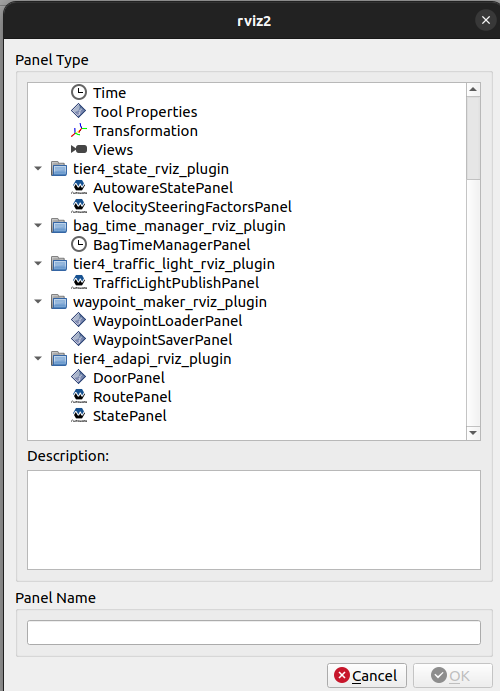
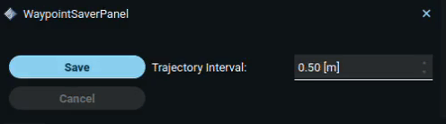
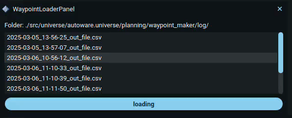

# waypoint_maker_rviz_plygin
This plugin panel controls the Waypoint Maker to save and load files.

## How to use

1. Start rviz and select panels/Add new panel.

  

2. Select waypointSaverPanel or waypointLoaderPanel and press OK.

  

### waypointSaverPanel
1. The trajectory interval can be adjusted to change the distance between two points.
2. Pressing the "Save" button will start recording, and the "Save" button will be disabled. The "Cancel" button will be enabled, and the file being recorded will be displayed at the top.
3. Pressing the "Cancel" button will stop the recording, and the "Cancel" button will be disabled. The "Save" button will be enabled, and the top display will refresh and become blank.

  

### waypointLoaderPanel
1. The list contains all the paths in the log. You can select a file from the list and press "Loading" to send a new path.
2. out_file.csv is the default path. If another file is used, it will overwrite the default path and become the new default path.
3. The "Loading" button can only be used when the vehicle is stopped.

  

